## Finding Similar Items

기본적인 데이터 마이닝 문제는 유사한 아이템에 대한 데이터를 검사하는 것입니다. 3.1에서 활용을 보여줍니다. 예시는 웹페이지 모음이나 복제된 페이지들을 찾는 것입니다. 이러한 페이지들은 표절이 될수도 있고 호스트 정보가 다르고 동일한 내용이 다른 미러가 될 수 있습니다. 

유사한 아이템 쌍을 찾는 단순한 방식은 모든 아이템 쌍을 다 찾아보는 것입니다. 대규모 데이터셋을 다룰 때 모든 데이터 셋을 찾는 것은 좋은 하드웨어를 갖고있더라도 제한적입니다. 예를 들어 백만의 아이템셋이 주어진다해도 조 단위의 쌍을 검사해야합니다. 그리고 백만의 아이템셋도 요즘 기준에는 작은축에 속합니다.

locality-sensitive hasing, LSH 는 모든 쌍을 다 보지 않고도 유사할 것 같은 쌍을 파악할 수 있도록 하는 기술이 있습니다. 이것은 기존 알고리즘의 쿼드라틱 계산시간을 피할 수 있게합니다. false negative 가 있기 때문에 LSH 의 단점은 항상 존재하긴합니다. - 검사한 쌍의 집합에 포함하되진 않지만 유사한 아이템의 쌍. 그러나 잘 조정하면 우리가 고려한 페어의 수를 높이면서 이러한 false negative를 줄일 수 있습니다. 

LSH의 기본 아이디어는 아이탬을 많은 해시 함수들을 사용하여 해시하는 것입니다. 이 해시함수들은 기존의 해쉬함수들을 나열한 것이 아닙니다. 대신 아이템끼리 유사할 수록 동일한 bucket 에 담기도록 속성을 잘 설계하는 것입니다. 그러고 나서 몇개의 후보쌍만 검사하면 됩니다. 적어도 하나 이상의 해시 함수들에서 동일한 버캣에 있는 아이템의 쌍만 검사하면 됩니다. 

공통 텍스트가 얼마나 있는지를 기준으로 유사한 문서를 찾는 문제를 가지고 LSH 에 대해 설명을 할 것입니다. 우선 문서를 집합으로 어떻게 표현하는지 보입니다. 문서의 문자적인(textual) 유사성을 많이 겹치는 집합으로 보는 방식을 사용합니다. jaccard 유사도로 집합의 유사성을 측정하는 것입니다. intersection과 union의 크기 비율을 사용합니다. 두번째로 minhashing 를 다룹니다. 이는 큰 셋을 더 작은 signature 라고 불리는 representation 으로 변환하는 방법입니다. 이 또한 jaccard 유사도를 사용하여 represented 집합을 추정할 수 있습니다. 마지막으로 3.4에서 signature에 LSH에 내재한 버켓팅 아이디어를 적용하는지에 대해 살핍니다. 

## 3.1 Applications of Set Simliarity

유사도의 특정 개념에 포커스를 맞춰봅시다. : 집합의 유사도, 그것들의 교집합의 상대적인 크기를 사용한. 이 유사도 개념은 jaccard 유사도라고 불립니다. 3.1.1 에서 다룹니다. 그러고 나서 유사한 집합을 찾는 것의 몇가지 용도를 들어 봅니다. 이것은 문자적으로 유사한 문서를 찾는 것을 포함하고 우사한 고객과 상품을 찾는 collaborative filtering 을 포함합니다. 문서의 문자 유사도 문제를 교집합의 하나로 바꾸기 위해 shingling 이라고 불리는 기술을 사용합니다. 이는 3.2에서 다룹니다. 

### 3.1.1 Jaccard Similarity of Sets

집합 S 와 T의 자카드 유사도는 $|S \cap T| / |S\cup T|$ 입니다. 합집합의 크기 분에 교집합의 크기 입니다. 이를 $SIM(S,T)$ 로 표기합니다. 

### 3.1.2 Similarity of Documnents

자카드 유사도가 잘 다루는 문제들의 중요한 클래스는 웹이나 신문기사와 같은 큰 코퍼스 내에서 문자적으로(texually) 유사한 문서를 찾는 것입니다. 우리가 여기서 보는 유사도의 양상은 문자 단위 유사도이며, 유사한 의미가 아닙니다. 이러한 문제 또한 흥미롭니다. 다른 기술로 다루는 문제입니다. 문자적 유사도를 다루는 문제는 복제본이나 유사 복제본을 찾는 것과 관련이 있습니다. 두 개의 문서가 완전히 복제된 것을 검사하는 작업은 쉽습니다. 문자 간 비교만 하면 됩니다. 그러나 실제 많은 상황에서 문서들은 동일하지 않지만 텍스트를 많은 부분 공유하지 합니다.

#### Plagiarism

표절된 문서를 찾는것은 문자적 유사도를 찾는 능력을 검증합니다. 표절자는 문서의 일부분만 뽑아서 쓸 것이고 몇개의 단어와 일부 순서를 바꿀 것입니다. 그래도 결과에는 원본에 많은 부분이 포함되 있을 것입니다.봅잡한 표절을 감지하는 문자와 문자만 비교하는 단순한 처리방식은 없을 것 입니다.

#### Mirror Pages

유면한 웹사이트는 많은 호스트로 복제되는 것은 일반적입니다. (로드 분배를 위한) 이러한 미러 사이트 페이지는 꽤 비슷하지만 거의 동일한 것은 아닙니다. 예를들어 각 사이트들이 그것들의 특정 호스트와 관련된 정보를 포함할 수 있고, 다른 미러 사이트들로 링크를 갖지만 그 자신에 대한 링크는 안갖는 경우도 있습니다. 관련된 예시로는 하나의 아카데미 클래스로부터 다른 곳으로 가는 웹페이지를 재사용하는 것입니다. 이러한 페이지들은 클래스 노트, 과제, 슬라이드등을 포함합니다. 유사 페이지는 코스의 이름, 년도 등 일부가 바뀔것입니다. 이러한 종류의 유사한 페이지를 갑지할 수 있는 것은 중요합니다. 검색엔진은 만약 결과물의 첫번째 페이지 안에서 거의 동일한 두개의 페이지를 보여주는 것을 피하고자 한다면 검색 엔진은 더나은 결과를 만들기 위해 중요합니다.

### 3.1.3 Collaborative Filtering as a Simliar-Sets Problem

집합의 유사도가 매우 중요한 실 적용의 또다른 종류는 collaborative filtering 이라 불리는 프로세스입니다. 이는 다른 사용자가 보여준 유사한 취향을 가진 아이템을 추천하는 것입니다. 자세하게는 9.3에서 다루지만 여기서 일반적인 예시를 보이겠습니다.

@@

 

## 3.2 Shingling of Documents

lexically 유사한 문서를 찾기위한 목적으로 문서를 집합으로 표현하기 위한 가장 효과적인 방법은 문서로 부터 그안에 있는 짧은 문자열의 집합을 만드는 섟입니다. 그렇게 하면 구나 문장들의 짧은 조각들을 공유하는 문서들은 그들의 집합에 많은 공통적인 요소를 갖고 있을 것입니다. 문장들이 다른 순서로 나타난다할지라도. 이 섹션에서는 가장 단순하고 일반적인 접근법인 shingling 과 변형에 대해 소개합니다. 

### 3.2.1 K-Shingles

문서는 문자들의 열(String) 입니다. 문서에 대한 K-shingle 은 문서에서 찾은 k길이의 substring 입니다. 그러고 우리는 각 문서를 k-shingle 의 집합과 연결할 수 잇습니다. 문서에 한번이상 나타난

#### example 3.3 

D가 abcdabd 의 경우 k=2 일때 {ab, bc,cd,da,bd} 입니다. 

Substring ab 의 경우 2번 나타나지만 shingle 에서는 한번 표현합니다. 싱글링의 변형에서는 set보다 bag 을 생성해서 각 싱글링이 문서에서 몇번 나타났는지에 대한 결과를 보여줍니다. 여기서는 bag 을 사용하진 않습니다. 

공백을 어떻게 처리할지에 관한 몇가지 옵션이 있습니다. (blank, tab newline ..) 아마 하나 이상의 시퀀스를 단일 블랭크 문자로 대체하는 것이 적당할 것입니다.  둘 이상의 싱글링 과 그렇지 않은 것을 구분합니다. 

#### example 3.4

k=9 를 사용하는 경우 

'The plane was ready for touch down' 과 'the quaterback scored a touchdown' 에서 'touch dow' ㅡ 'touchdown' 이 다르지만 공백을 제거하는 경우 동일하게 touchdown이 될 수 있습니다.

### 3.2.2 Choosing the Shingle Size

어떤 k 도 선택을 할 수 있지만, k 가 너무 작으면 k 문자들의 시퀀스는 대부분의 문서들에서 보일 수 있습니다. 이러면 문장이나 구가 동일한게 없다라도 높은 자카드 유사성을 갖는 문서나 보일 수 있습니다. k=1 인경우를 예를 들어봅시다. 일반적으로 웹페이지들은 대부분의 문자를 갖고 있고 그래서 모든 웹페이지 들이 높은 유사도를 갖게 될 것입니다.

k 의 크기는 일반적으로 문서가 얼마나 큰기와 일반적인 문자의 집합이 얼마나 큰지에 달려있습니다. 

- K 는 어떤 문서에서의 주어진 싱글링이 있을 확률이 충분이 낮은 것으로 선택되어야 합니다. 

문서의 코퍼스가 이메일이면, K는 5 가 괜찮습니다. 이메일에서는 문자와 공백만 나옵니다. 영문 공백 합쳐서 $27^5 = 14,348,907$ 의 가능한 싱글이 있을 수 있습니다. 일반적인 이메일은 14백만 문자보다 작으므로 k=5 가 잘 동작한다고 기대할 수 있고 잘 동작합니다. 

이메일에서는 확실히 27개의 문자보다 더 많지만 모든 문자가 동일한 확률로 나타나지는 않습니다. 일반적인 글자와 공백이 우세한 반면 글자 맞추기에서 "z"와 높은 점수를 갖는 다른 글자는 드뭅니다. 그래서 일반 문자들로 구성된 5-shingle 이 많은 짧은 이메일이여도 위의 식대로 하면 관련없는 이메일일 가능성이 더 높습니다. 큰 문서와 같은 경우 k=9 가 적당합니다. 

### 3.2.3 Hashing Shingles

shingle로서 substring 을 바로 사용하는 것 대신, k 길이의 문자열을 특정 버켓에 매핑시키는 해시 함수를 선택하고 버켓의 수를 shingle 로 다룰 수 있습니다. 문서를 표현한 집합은 문서에서 하나이상의 k-shingle 의 버켓의 숫자의 집합이 될 수 있습니다. 예를들어, 우리는 구성할 수 있습니다. 9싱글의 집합을 문서에 대한, 그러고 그러한 9싱글들의 각각을 버킷넘버로 매핑시킵니다. 그 숫자의 범위는 0부터 $2^{32}-1$ 입니다. 그래서 각 싱글링은 표현됩니다. 4개의 바이트로 9 대신. 데이터가 압축될 뿐 아니라 해쉬된 싱글을 다룰 수 있습니다 single-word machine operation으로.

우리는 문서를 구분지을 수 있습니다. 더 잘, 만약 9 싱글을 사용하고 해시하여 4 바이트로 만드는 것이 4 싱글을 사용하는 것보다, 공간이 동일하게 사용된다 할지라도. 그 이유는 위의 3.2.2 에서 다뤘습니다. 만약 4싱글을 사용한다면 대부분의 4바이트 시퀀스는 거의 안하거나 할 수 없습니다. 일반적인 문서에서 찾는 것을. 그래서 다른 싱글의 효과적인 숫자는   $2^{32}-1$  보다 훨씬 작습니다.
만약 3.2.2에서 20개의 문자만 나타난다면, 발생할 수 있는 다른 4싱글의 수는 겨우 $20^4 =160,000$ 입니다. 그러나 9싱글을 사용한다면 $2^{32}$ 보다 많이 생깁니다. 그것을 4바이트로 해시할 때 4바이트의 시퀀스의 거의 대부분이 가능하다고 기대할 수 있습니다.

### 3.2.4 Shingles Built from Words

싱글의 다른 형태는 효율적이라고 증명되고 있습니다. 유사한 기사를 찾는 문제에서. 
이 문제에 대해 악용가능한 차이점은, 뉴스기사가 기사 페이지에 전형적으로 보여지는 다른요소들 보다 다른 스타일로 쓰여지는 것입니다.
신문기사와 대부분의 산문들은 많은 stop words 를 갖고 'and' 'you' 'to' 와 같은 공통 단어가 많습니다. 
많은 활용에서 우리는 이 stop word를 무시하고싶습니다. 왜냐하면 이것들은 기사에 대한 어떠한 중요한 것도 다루지 않기 때문입니다.

그러나 이런 유사한 기사를 찾는 문제에서 next two word에 딸린 stop word 가 있도록 싱글을 정의하는 것을 찾았습니다. 스탑워드가 있든지 없든지 간에, 유용한 싱글 집합을 형성하는
이 접근법의 이점은 뉴스기사의 주변 정보보다, 페이지를 나타내는 세트에  더 많은 싱글링을 제공한다는 것입니다.
이 작업의 목표는 주변 요소들과 상관없이 동일한 기사를 갖은 페이지를 찾는 것이었습니다.
기사에 관한 싱글의 집합에 편향을 둠으로서 동일한 기사, 다른 주변 요소를 가진 페이지가 더 높은 jaccard 유사도를 갖게 됩니다. - 동일한 주변요소를 갖지만, 다른 기사인 것 보다 

## 3.3 Similarity-Preserving Summaries of Sets

싱글의 집합들은 매우 큽니다. 그것들을 4바이트로 해시를 하더라도 그 집합을 저장할 공간은 여전히 기존 문서에 4배 정도는 더 큽니다. 
수백막의 문서가 있다면 이것의 싱글 셋은 메인 메모리에 둘 수 없습니다.

이 세션에서의 목표는 큰 집합을 더 작은 representations 인 *signature* 로 대체하는 것입니다. 시그니처에 대해 우리가 필요로하는 중요한 속성은 우리가 두개의 집합의 시그니처를 비교하고, 시그니처만으로 그 해당하는 집합의 자카드 유사도를 추정하는 것입니다. 시그니처가 그것들이 표현한 집합의 유사도를 정확하게 표현하는 것은 가능하지 않지만, 가까운 추정값을 제공합니다. 그리고 시그니처가 많을수록 추정의 정확도는 높아집니다. 
예를들어 200,000 바이트의 해시된 싱글 셋을  1000 바이트의 시그니처로 바꾼다면 일반적으로 몇 퍼센트 내로 도달할 수 있습니다.

### 3.3.1 Matrix Representation of Sets

어떻게 시그니처를 구성하는것이 가능한지 설명하기 전에, characteristic matrix 로서 집합의 모음을 시각화하는 것이 도움이 됩니다. 
행렬의 칼럼은 집합을 나타내고, 로는 전체 집합의 요소들을 나타냅니다. 그리고 집합의 요소가 그려지는 요소입니다.
행의 엘리먼트 r 이 집합 칼럼 c 의 멤버인 경우 r 행, c 열은 1 이 됩니다. 아니면  0 이 됩니다.

example3.6

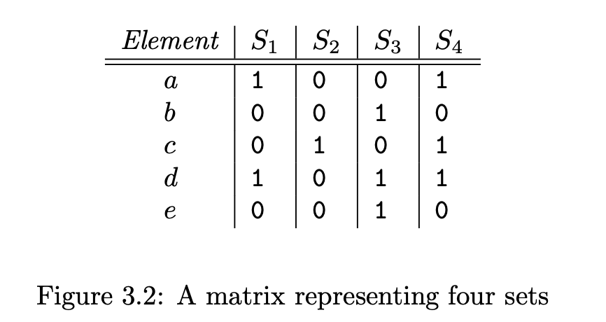

$S_1 = \{ a,d \},S_2 = \{ c \},S_3 = \{ b,d,e\},S_4 = \{ a,c,d \},$

characteristic matrix 이 데이터가 실제 저장되는 방식이 아닐 수 있지만, 시각화하기에 유용한 것을 유의합시다.
행렬에 데이터를 저장하지 않는 이유는 이 행렬이 실제로는 항상 sparse 하기 때문입니다. 1이 나타나는 위치로 0과 1의 희소 행렬을 나타내는 공간을 절약합니다. 
다른 이유는, 데이터는 일반적으로 다른 목적으로 다른 형식으로 저장됩니다.

예시로, 행이 물품이고 열이 고객, 그들이 산 물품의 집합을 나타내는, 그러면 이 데이터는 실제로 구매의 데이터베이스 테이블로 보여질 것입니다. 이 테이블에서 튜플은 아이템, 구매자, 세부사항 등으로 나열될 것입니다. 

### 3.3.2 Minhashing

우리가 만들기 원하는 집합의 시그니처는 많은 계산 결과로 구성됩니다. 수백개의 각각이 특성 행렬(=characteristic matrix) 의 minhash 인 것입니다. 
이 세션에서 민해시가 이론적으로 어떻게 계산되는지 다루고, 실제상황에서 어떻게 민해시의 유사치를 계산하는지 다룹니다.

특성행렬의 컬럼을 표현한 집합을 민해시 하기 위해 행의 순열(=permutation)을 선택합니다. 어떤 칼럼의 민해시 값은 순열 순서로 칼럼이 1을 갖는 첫번째 로우의 숫자 입니다.

example3.7

여기서 beadc 순으로 순열을 골랏다고 가정해 봅시다. 

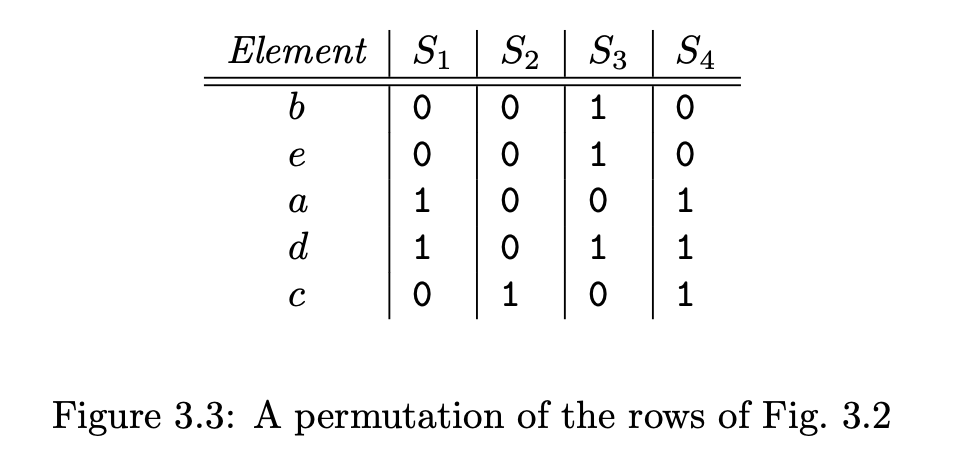

이 순열은 민해시 함수 h 를 정의하고 h 는 집합을 로우로 맵합니다. h를 따르는 집합 S1 의 민해시값을 계산해봅시다. 첫번째 칼럼, S1에 대한 칼럼인, b 로우에서 0을 갖습니다. 이렇 로우 e 도 진행하고 로우 a 에 왔을 때 1을 찾았습니다. 그래서 h(s1) = a 가 됩니다.

비록 매우 큰 특성행렬을 수행하는 것은 물리적으로 불가능하지만, 민해시 h 는 암시적으로 로우를 재정렬합니다. 3.2행렬을 그래서 3.3 행렬으로 만듭니다. 여기에서는 위에서부터 1을 찾을 때까지 스캔하면서 h의 값을 읽어갈 수 있습니다. 그래서 h의 값들을 찾을 수 있습니다.

### 3.3.3 Minhashing and Jaccard Similarity

민해시와 민해시된 집합의 자카드유사도 사이 연관성이 높습니다. 

- 행의 랜덤 순열에 대한 민해시 함수가 두 세트에 대해 동일한 값을 생성 할 확률은 해당 세트의 Jaccard 유사성과 같습니다.

이유를 살펴보면, 두 집합의 칼럼을 그려봐야합니다. 집합 S1,S2 칼럼만 사용한다면 , 로우를 3개의 클래스로 나눌 수 있습니다.

1. 타입 X : 칼럼 둘다 1
2. 타입 Y : 하나는 1이고 하나는 0인 칼럼
3. 타입 Z : 둘다 0

행렬이 sparse 하기 때문에 대부분의 행은 Z타입 입니다. 그러나 X와 Y 의 숫자 비율은 SIM(S1,S2) 와 h(S1) = h(S2) 일 확률 둘 다로 결정됩니다.
X 타입인 행들 x 와 Y 타입인 행들 y 가 있다고 합시다. 그러면 SIM(S1,S2) = x / (x+y) 가 됩니다. - x 는  $S_1\cap S_2$ 의 크기이고 x+y 는 $S_1\cup S_2$ 의 크기입니다.

이제 해시 h(S1) = h(S2) 를 고려해봅시다. 행이 무작위로 나열되었다고 가정해봅시다. 그리고 위에서부터 진행을 합니다. 여기서 Y 타입의 행을 만나기 전에 X 타입의 행을 만날 확률은 x/(x+y) 가 됩니다.
만약 Z 이외에 만나는 첫번째 행이 X타입의 행이면,  확실하게 h(S1) = h(S2) 이 됩니다. 
반면에, Z이외에 첫번째 행이 Y타입 행이라면, 1을 가진 집합은 그것의 행을 민해시 값으로 가져옵니다. 그러나 해당 행에 0이있는 세트는 반드시 순열 목록 아래의 일부 행을 가져옵니다.
그래서 Y타입 행을 처음으로 만나는 경우 $h(S_1) \neq h(S_2)$ 가 됩니다. 
결론적으로,   h(S1) = h(S2)  는 x/(x+y) 이고 이는 S1, S2의 자카드 유사도 입니다.

### 3.3.4 Minhash Signatures

특성집합 M 에 의해 표현된 세트의 컬렉션을 다시 생각해 봅시다. 셋을 표현하기 위해 우리는 무작위로 M의 행의 n 순열을 선택합니다. 아마 100개의 순열, 수백개의 순열을 할 것입니다. 민해시 함수들은 이러한 순열들 $h_1,h_2 \cdots, h_n$ 에 의해 결정됩니다. 칼럼 표현 집합 S 로부터, S 에 대한 minhash signature,벡터 [h1(S),h2(S), .. hn(S)] 를 구성합니다.
우리는 일반적으로 이 해시값의 리스트를 하나의 칼럼으로 표현합니다. 
그래서 우리는 signature matrix 라는 행렬 을 M을 사용해 구성할 수 있습니다. 여기서 M의 i 번째 칼럼은 i 칼럼에 대한 minhash signature 로 대체됩니다.

시그니처 행렬은 M과 같은 열의 수를 갖습니다. 그러나 행의 수는 n 개입니다.
 M이 명시적으로 표현되지않지만, 어느정도 희소 행렬에 대해 적합한 형태로 압축됩니다.(1에 위치한 것이 대해) 시그니처 행렬이 M보다 훨씬 작은 것이 일반적입니다.

시그니처 행렬에 대해 주목할 만한 것은 우리가 그 칼럼을 사용하여 그것을 따르는 셋의 자카드 유사도를 추정할 수 있다는 것입니다. 
3.3.3 에서 증명한것에 의해, 우리는 시그니처 행렬의 행이 주어졌을 때 같은 값을 갖는 두 칼럼이 두 세트의 자카드 유사도와 동일하다는 것을 확인하였습니다. 
더욱이 민해시 값을 기반으로 하는 순열은 독립적으로 선택되었기 때문에, 시그니처 행렬의 각 행들은 독립적인 시행으로 생각할 수 있습니다.
따라서 두 열이 일치하는 예상 행 수는 해당 세트의 Jaccard 유사성과 같습니다.
더욱이 많은 민해시를 사용할수록 더 많은 행이 생기고 자카드 유사도의 추정 에러가 줄어듭니다.

### 3.3.5 Computing Minhash Signature in Practice 

큰 특성 행렬을 명시적으로 치환하는 것은 불가능합니다. 행들의 수백 수억 개의 무작위 순열을 고르는 것도 시간이 소요되고 행들을 정렬하는데 필요한 시간도 많이 걸립니다. 그래서 그림 3.3 과 같은 순열된 행렬들은 개념적으로는 좋으나 구현할 수 없습니다.

다행이도 시뮬레이션 가능합니다. 

### 3.3.6 Speeding Up Minhashing

민해시 작업은 시간이 많이 소요됩니다. 왜냐면 우리는 행렬 M 의 전체 k 행을 각 해시 함수에다 검사해봐야합니다. 세션 3.3.2 에서 행들을 실제로 치환하였습니다. 모든 칼럼에 대해 하나의 해시 함수로 계산을 하였지, 순열의 끝까지 모두 계산한 것이 아니라, k 개 중 첫번째 m 개의 행들만 보았습니다. 만약 우리가 k 보다 작은 m 을 만들면, 우리는 작업을 k/m 배 줄일 수 있습니다.

그러나 m 을 작게 만드는 것은 단점이 있습니다. 각 칼럼이 적어도 하나의 1을 갖는 한, m번째 이후 행들이 어떠한 민해시 값에 영향이 없어야하고 그것이 없을 수도 있습니다. 그러나 m번째 행들에서 모두가 0인 칼럼이 있다면 어떻게 할까요. 이 칼럼에는 민해시값을 갖을 수 없읍니다. 대신 우리는 특별한 기호 $\infty$ 를 사용합니다.

3.3.4 에서 자카드 유사도를 추정하기 위해 두개의 칼럼의 민해시 시그니처를 검사할 때, 우리는 시그니처의 일부 요소의 민해시 값이 $\infty$ 를 갖는 하나 혹은 둘다 의 칼럼이 있을 가능성을 고려해야만 했습니다. 3가지 경우가 있습니다.

1. 주어진 행에서 두 칼럼 모두 $\infty$ 을 갖는다면, 바꿀 필요가 없습니다. 두 값이 같다면 같은 값의 행의 수를 세고, 아닌 경우도 계산합니다.
2. 한 칼럼만 $\infty$ 을 갖는 경우, 우리가 기존 행렬 M의 모든 행들을 사용한다면, 그 $\infty$ 가 나온 칼럼은 결국엔 특정 값을 어떤 행 번호에서 갖을 수 있습니다.  그리고 그 행 번호는 아마 처음 m 들에는 없을 것입니다. 그러나 다른 칼럼은 처음 m 행들 중 하나인 한 값을 갖을 것입니다. 그래서 우리는 확실하게 이 예시에서 민해시 값이 다르다는 것을 알 수 있습니다.
3. 둘다 $\infty$ 인 경우입니다. 그러면 처음 치환된 행렬 M 에서, 두 칼럼에서 첫번째 m 행에서는 0입니다. 그래서 이 집합들에 대한 자카두 유사도 정보가 없습니다. 이 유사도는 k-m 이후 행들의 함수에 있습니다. 이것을 우리가 선택하지 않은것들입니다. 따라서 서명 행렬의이 행을 동일한 값이나 같지 않은 값의 예로 계산하지 않습니다.

이 3번째 경우는 드물고, As long as the third case, where both columns have ∞, is rare, we get almost as many examples to average as there are rows in the signature matrix

이 효과는 자카드 거리의 추정 정확도를 조금 줄이지만 많이는 아닙니다. 그리고 우리는 전제 행을 검사하는 것보다 훨씬 빠르게 칼럼들을 계산할 수 있기 때문에 우리는 몇개의 더 많은 민해시 함수를 적용할 시간이 생깁니다. 그래서 우리는 기존보다 더 나은 정확도 뿐 아니라 더 빠르게 할 수 있습니다.

### 3.3.7 Speedup Using Hash Function

이전처럼, 3.3.6 에서 가정된 방식에서는 행들을 물리적으로 치환할 수 없는 몇가지 이유들이 있습니다. 그러나 실제 치환의 아이디어는 3.3.2보다 3.3.6의 내용이 더 말이 됩니다. 
그 이유는 우리는 k 개의 모든 순열을 구성할 필요가 없을 뿐 아니라 k 보다 작은 m 개의 숫자를 선택하고 그 행들의 랜덤 순열을 선택하기만 하면 됩니다. m의 값과 행렬 M이 어떻게 저장되는지에 따라, 3.3.6에서 제시된 알고리즘을 따르는 것 가능할 수 있습니다.

그러나  3.3.5와 비슷한 전략이 더 필요할 것입니다.
현재 M 의 행들은 고정되어 있고, 치환되지 않았습니다. 우리는 행 숫자들을 해시하는 해시 함수를 선택하고, 처음 m개의 행들에 대해서만 해시값을 계산합니다. 
이것은 3.3.5의 알고리즘을 따릅니다. 그러나 우리가 m번째 행에 도달하고 멈춥니다. 각 칼럼에 대해 우리는 최소 해쉬값을 취합니다.(칼럼에 민해쉬값까지)

어떤 칼럼은 m 행까지 모두 0일 수 있기 때문에 일부 민해시값이 $\infty$ 일 수 잇습니다. m이 충분하게 커서  $\infty$ 민해시 값은 거의 드물다고 가정해보면, 우리는 여전히 이 시그니처 행렬의 컬럼을 비교함으로서 집합의 자카드 유사도를 잘 추정할 수 있습니다. 
T가 처음 m 을 표현하는 전체집합의 엘리먼트의 집합이라 가정해봅시다. S1,S2 는 M의 두 칼럼을 나타냅니다. 그러면 M의 첫번째 m 행들의 집합은 $S_1 \cap T$  ,$S_2 \cap T$ 로 표현합니다. 이 두 집합이 모두 공집합이면 , 민해시 함수는 $\infty$ 일것입니다. 두 칼럼에서, 그리고 무시될 것입니다. 자카드 유사도를 추정할 때 .

 $S_1 \cap T$ , $S_2 \cap T$ 가 적어도 하나가 nonempty 라면, 민해시 함수에 대해 동일한 값을 갖을 확률은 두 집합의 자카드 유사도와 같고 이는 다음과 같습니다.

 $$\frac{|S_1 \cap S_2 \cap T |}{|(S_1\cup S_2)\cap T |}$$

T가 전체 집합의 랜덤 부분집합으로 선택된다면, 이 분할의 기대값은 S1,S2의 자카드 유사도 값과 같을 것 입니다.
그러나 T에 따라 일부 랜덤 편차가 있을 것이고 X행과 Y 행의 평균 숫자라 조금 차이가 있을 것입니다. 

이러한 차이를 줄이기 위해서, 우리는 각 민해싱에서 동일한 T 집합을 사용하지 않습니다. 대신 M의 행들을 k/m 그룹으로 나눕니다. 그러고 각 해시 함수에 대해, 우리는 m 행들에 대해서만 검사함으로서 민해시 값을 계산합니다. 두번째 m 행들에 대해서는 다른 민해시 값을 검사하고, 이렇게 진행합니다.
그래서 우리는 k/m 민해시 값들을 얻습니다. 각 단일 해시 함수와 M의 모든 행들 중 단일 패스로 부터. 
k/m 이 충분히 크면, 우리는 시그니처 행렬의 모든 행을 얻을 수 있습니다. 우리가 필요로한, M 의 행들의 부분집합 각각에 단일 해시함수를 적용하면서

더욱이, 민해시 값들 중 하나를 계산하기 위해 M의 행들을 각각 사용하면서, 우리는 자카드 유사도의 추정 에러를 조절하였습니다. 그것이 그 행들 중 특정 부분집합이기 때문입니다.
이는, S1,S2의 자카드 유사도는 X,Y 타입의 비율을 결정하기 때문입니다. X타입의 모든 행들은, k/m 집합에 분배되어 있고, Y 도 마찬가지 입니다. 
그래서 m행들 중 하나의 집합이 평균보다 더 많은 타입을 갖더라도, 그러면 다른 집합에서 평균보다 더 적은 수의 타입을 갖게됩니다. 

#### example 3.5

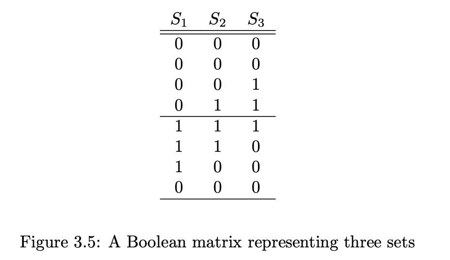

k=8 이고 m을 4 로 골라봅시다. 하나의 행을 통과하면서 첫번째 행 값을 기반으로한 하나의 민해시 값과, 두번째 행을 기반으로한 민해시 값, 총 2개의 해시 값을 얻습니다. 

3집합의 자카드 유사도는 다음과 같습니다. $SIM(S_1,S_2)$ = 1/2, $SIM(S_1,S_3)$ = 1/5 , $SIM(S_2,S_3)$ = 1/2

우선 첫번째 4개의 행들만 봅시다. 어떤 해시함수를 쓰든, S1에 대한 민해시 값은 $\infty$ 일 것입니다. S2 는 4번째 행의 해시 값일 것입니다. S3 는 3번째나 4번째 해시 값 중 작은 값 일 것입니다.
그래서, S1,S2에 대한 민해시 값을 절대 일치하지 않습니다. 이것은 말이

@@

15

## 3.4 Locality-Sensitive Hashing for Documents

비록 우리가 민해싱을 사용하여 큰 문서들 작은 시그니처로 압축하고 문서의 기대 유사도를 보존할 수 있지만, 여전히 쌍의 유사도를 효율적으로 찾는 것은 어렵습니다. 
그 이유는 문서의 쌍의 수 가 너무 커서 입니다. 문서가 많지 않더라도

example 3.10

백만개의 문서가 있다고 가정해봅시다. 그리고 우리는 250길이의 시그니처를 사용합니다. 그러면 우리는 시그니처로 1000 바이트를 사용합니다.(문서당) 그리고 전체 데이터는 1기가바이트 안에 듭니다. 일반적인 랩탑에 메인메모리 보다 적게
그러나 (1,000,000  2) 나 5천억 쌍이 문서에 있습니다. 만약 두개의 시그니처의 유사도를 계산하는데 1 ms 가 걸린다면, 랩탑에 전체작업은 거의 6일정도가 소요됩니다.

만약 우리의 목표가 모든 쌍의 유사도를 계산하는 것이면, 이 작업을 줄일 수 있는 방법은 없습니다. 병렬로 처리해서 시간은 조금 줄일 수 있습니다.ㄴ

그러나, 우리는 종종 오직 많이 유사한 쌍들이나 어느 정도 이상의 유사한 노드 쌍 만 원할 때가 있습니다. 그렇다면 우리는 우리는 모든쌍이 아닌 유사할것 같은 쌍에만 집중하면 됩니다. 이러한 포커스를 어떻게 제공하는지에 대한 일반적인 이론이 LSH, near-neighbor search 입니다. 
여기에서는 LSH 의 특정 형태에 대해 고려해 봅니다. - 이는 시글 집합에 의해 표현되고, 짧은 시그니처로 민해시된. 
3.6에서는 일반 이론에 대해 설명하고 사례와 관련 기술에 대해 다룹니다. 

### 3.4.1 LSH for Minhash Signatures

우리으이 일반적 접근은 hash 하는 것입니다. 아이템을 여러번, 이러한 방식에서 유사한 아이템들은 같은 버킷에 해시될 가능성이 높습니다. 다른 것 보다.
그러고나서 같은 버킷에 있는 쌍들에 대해 고려합니다. 이것을은 candidate pair 가 됩니다.
우리는 후보쌍들의 유사도만 체크하면 됩니다. 유사하지 않은 쌍의 대부분은 같은 버킷에 해시되지 않고 체크 되지 않기를 희망합니다. 이러한 유사하지 않는 쌍들을 같은 버킷에 해시하는 것을 false positive 라 합니다. 우리는 이것이 전체에서 작은 부분만 있기를 바랍니다. 
또한 실제 유사한 쌍들의 대부분이 해시 함수에 적어도 하나는 같은 버킷에 해시되기를 원합니다. 유사한 것이 버킷에 없는 것을 false negative 라 합니다. 우리는 실제 유사한 쌍에서 이것이 적게 나오기를 희망합니다. 

아이템들에 대한 민해시 시그니처를 갖고 있을 때 
해싱을 선택하는 효율적인 방법은 시그니처 행렬을 r개의 행으로 구성된 b개의 밴드들로 나누는 것입니다.
각 밴드는 해시 함수가 있고 이는 r 정수들의 벡터를 취합니다.(그 밴드 안의 한 칼럼의 분할) 
그리고 그것들을 버킷의 큰 숫자로 해시합니다. 
우리는 모든 밴드들에 동일한 해시 함수를 사용할 수 있습니다. 
그러나 우리는 각 밴드마다 별도의 버켓 배열을 사용해야합니다. 그래서 동일한 벡터의 칼럼이더라도 다른 밴드의 것이면, 같은 버켓에 해시되지 않습니다.

#### example 3.1

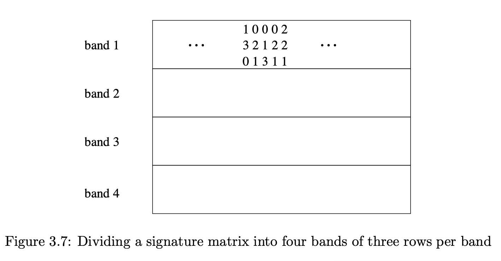

위 그림은 12행인 시그니처 행렬을 보여줍니다. 4개의 밴드로 나눠져있고 각 3개의 행이 있습니다.

두번째와 4번째에서 보여진 칼럼은 둘다 [0,2,1] 의 벡터를 갖습니다. 이는 확실하게 첫번째 밴드의 동일한 버킷에 해시가 됩니다.
다른 새개의 밴드에서 칼럼이 어떤지와는 무관하거, 이 칼럼의 쌍은 후보쌍이 됩니다. 
다른 칼럼, 1,2번 [1,3,0] [0,2,1] 또한 벡터가 다르지만 해시되어 동일한 버킷에 들어갈 수도 있습니다.  그러나 칼럼 벡터가 다르기때문에 많은 버켓에서 우연히 해시가 충돌할 확률이 매우 낮을 것으로 기대합니다.(expect)
우리는 일반적으로  두 벡터가 같은 버켓으로 해시됬다는 것은 둘이 동일하다고 가정할 수 있습니다.

밴드 1에서 일치하니 않은 두 칼럼은 그래도 3번의 후보쌍이 될 기회가 있습니다. 그것들은 아마 다른 밴드 중 하나에서 동일하게 나올 것입니다.
그러나 두 칼럼이 유사할 수록 특정 밴드에서 동일할 확률이 높습니다.
그래서 직관적으로, 밴딩 전략은 유사한 칼럼들이 아닌 쌍보다 더 후보쌍이 되도록 만듭니다.

### 3.4.2 Analysis of the Banding Technique

우리가 b 개의 밴드를 사용하고, 자카드 유사도 s 를 갖는 특정 문서 쌍이 하나 있다고 생각해 봅시다. 
3.3.3에 따라 민해시 시그니처가 일치하는 확률은 s 입니다.
우리는 이 문서들이 후보쌍이 될 확률을 다음과 같이 계산할 수 있습니다.

1. 한 밴드에서 모든 행에 있는 시그니처가 일치하는 확률은 $s^r$ 이다.
2. 한 밴드에서 적어도 하나의 행에서 시그니처가 다른 확률은 1-$s^r$  이다. 
3. 각 밴드들에서 적어도 하나의 행에서 시그니처가 다른 확률은 $(1-s^r)^b$ 이다.
4. 적어도 하나의 밴드에서 모든 행에 있는 시그니처가 일치하는 확률, 즉, 후보쌍이 될 확률은 $1-(1-s^r)^b$ 이 됩니다.

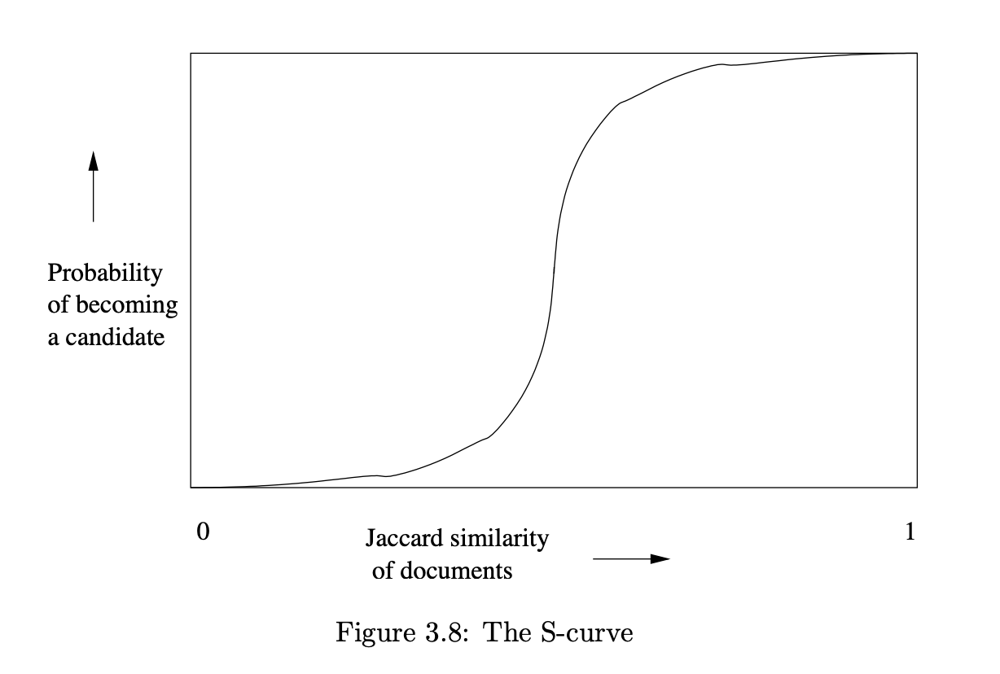

이것이 명백하지 않을 수 있습니다. 그러나 상수 b와 r 과는 무관하게 이 함수는 S-curve 의 형태를 갖습니다. 3.8처럼.
후보쌍이 되는 확률인 유사도의 값 s 의 임계값은 1/2 입니다. 
이 임계값은 대략적으로 가장 가파른 곳입니다. 
그리고 큰 b 와 r 에 대해, 우리는 임계값위에 있는 유사도를 가진 쌍이 후보가 될 확률이 높다는 것을 찾을 수 있습니다. 그리고 그보다 낮은 것은 후보가 될 확률이 낮다는 것을.(우리가 원하는 상황입니다.)
임계값의 근사치는 $(1/b)^{1/r}$ .
예를 들어 b= 16 r =4 이면, 임계값 s=1/2 가 됩니다. (1/16)^(1/2)

example 3.12@@

### 3.4.3 Combining The Techniques

우리는 접근법을 줍니다. 유사한 문사에 대한 후보쌍 집합을 찾는, 그리고 발견하는 것 그것들 중에 유사한 문서를.
이 접근법이 false negative 를 만들 수 있다는 것은 명심해야합니다. 이러한 확인 되지 않은 유사 문사의 쌍은 그것들이 절대 후보 쌍이 될 수 없기 때문입니다.
그리고 false positive 도 있을 수 있습니다. - 유사하지 않지만 버킷안에 있는 것

1.  k 를 하나 고르고 각 문서로부터 k-shingle 을 구성합니다. 
   옵션: k-shingle 을 더 짧은 버킷으로 해시할 수 있습니다.
2. shingle으로 document-shingle 쌍을 정렬합니다.
3. 민해시 시그니처에 대한 길이 n 을 선택합니다. 정렬된 리스트에 3.3.5 알고리즘을 사용하여 모든 문서에 대해 민해시 시그니처를 계산합니다.
4. 임계값 t 를 설정합니다. 이는 문서의 유사도 쌍을 어떻게 간주할 것인가를 정의합니다.
   b와 r을 선택하고 t의 임계값 대략적으로 (1/b)^(1/r) 을 설정합니다. 
   false negative 를 피하는것이 중요하다면, b 와 r의 임계값이 t 보다 작게 설정합니다. 
   속도가 중요하고 False positive를 피하도록 한다면, 임계값을 기존보다 높게 잡으면 됩니다.
5. 3.4.1 의 LSH 를 적용하여 후보쌍을 구성합니다.
6. 각 후보쌍의 시그니처를 검사하고,구성 요소의 비율이 t  이상인지 확인합니다.
7. 옵션: 만약 시그니처가 충분히 유사하면, 문서가 실제로 유사한지 확인합니다. 운좋게 유사한 시그니처를 갖고있는게 아닌지 확인하는 것입니다.  

## 3.5 Distance Measures

거리 측정의 일반적인 개념을 공부하기 위해 조금 돌아서 봅시다.
자카드 유사도는 세트들이 얼마나 가까운지 측정하지만 이것이 실제 거리 측정은 아닙니다. 집합이 가까울 수록 더 높은 자카드 유사도를 갖습니다.
대신 1- jaccard similarity 는 거리 측정이고 이를 jaccard distance 라고 합니다.

자카드 거리만이 유일한 근접성 측도가 아닙니다. 이 세션에서는 다른 거리 측도들을 설명합니다.
그러고 3.6에선, 이런 거리 측도 중 일부가 어떻게 LSH 기술을 갖는지에 대해 봅니다. 거리측도의 다른 적용은 7단원의 클러스터에서 다룹니다.

### 3.5.1 Definition of a Distance Measure

space 라고 불리는 점의 집합을 가정해 봅시다. 
이 공간에서 거리 측정은 함수 d(x,y) 입니다. 이는 공간 안의 2개의 점을 인자로 받고 실수를 출력합니다. 그리고 다음 공리를 만족합니다.

1. $d(x,y) \geq 0$
2. $d(x,y) = 0$ if and only if $x = y$
3. $d(x,y)  = d(y,x)$
4. $d(x,y)\leq d(x,z)+d(z,y) $

삼각 부등식(= triangle inequality ) 는 가장 복잡한 조겁입니다. 직관적으로 x에서 y로 갈 때, 우리는 어떤 3번째 점 z 를 통해 가는 것의 어떠한 이점도 얻을 수 없습니다. 삼각 부등식 공리는 마치 거리가 한 점에서 다른 점으로의 최단 경로의 길이를 나타내는 것 처럼, 거리측정이 수행되도록 합니다.

### 3.5.2 Euclidean Distances

가장 익숙한 거리측정은 우리가 일반적으로 생각하고 있는 'distance'입니다. m차원 유클리드 공간은 점들이 n개의 실수로 된 벡터들입니다. 공간에서의 전통적인 거리 측정은, L2 놈이라고도 표현하는, 다음과 같이 정의됩니다.

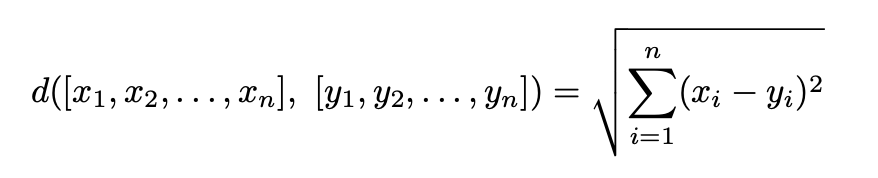

각 차원의 거리를 제곱하고 그 값을 더한다음에 양의 제곱근을 취합니다.

거리 측정에 대한 처음 세 가지 요구 사항이 충족되었는지 쉽게 확인할 수 있습니다. 두 점사이의 거리는 음수가 될 수 없습니다.양의 제곱근이기 때문입니다. 실수의 모든 제곱들이 음수가 아니기 때문에, $x_i \neq y_i$ 인 어떤 i 도 거리가 반드시 음수이도록 강제합니다. 
$x_i = y_i$ 인 모든 i 에 대해서 경우에는 거리는 명백히 0 이 됩니다. 
대칭도 됩니다. $(x_i - y_i)^2 = (y_i - x_i)^2$ 이기 때문입니다.
삼각부등식은 검증하기 위해 많은 대수가 필요합니다. 그러나 유클리드 공간 속성으로 잘 이해됩니다. : 삼각형의 두변의 길이의 합은 세번째 변보다 작지 않습니다.

유클리드 공간에서 사용되는 다른 거리 측정법도 있습니다. 어떤 상수 r에 대해 거리 측정 d로  L_r -norm 이라고 정의할 수 있습니다.

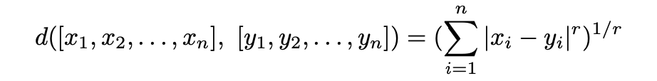

r=2 인 경우 이전에 언급한 L_2 입니다.

다른 일반적인 거리 측도는 L_1 -norm, Manhattan distance 입니다. 두 점 사이 거리는 각 차원에서 차이의 정도(magnitude) 의 합입니다. 이게 맨허튼 거리라고 불리는 이유는 점 사이를 이동할 때 그리드를 따라가야하는 제약이 있는 거리입니다. 맨허튼의 거리처럼

다른 특징있는 거리츨도는 $L_\infty-norm $ 입니다. rdㅣ 커질수록 가장 차이가 큰 차원만 중요해집니다. 즉, 전체 차원 중  $|x_i-y_i|$ 가 최대인 i 에 대해 정의 됩니다.

example 

2차원 유클리드 공간에서 두 점 (2,7), (6,4) 사이 거리

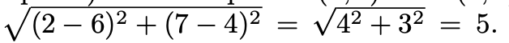 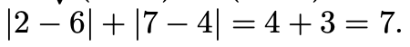 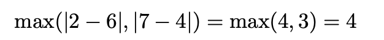

> r이 높을수록 값의 차이가 많이 나는 차원의 영향이 커진다. 

### 3.5.3 Jaccard Distance

자카드 거리를 1 - sim(x,y) 로 정의했습니다. 이 함수가 거리측도인지 확인을 해봐야합니다.

1. d(x,y) 는 nonnegative 입니다. intersection의 크기는 union을 넘길 수 없습니다.
2. d(x,y) = 0 이면 x=y 입니다. $x\cup x = x \cap x = x$ 이기 때문입니다.
   그러나 $x\neq y$ 이면 $x\cap y$ 는 무조건 $x\cup y$ 보다 작아야합니다. 그래서 d(x,y)는 확실히 양수 입니다. 
3. d(x,y) = d(y,x), $x\cup y = y \cup x$ , $x\cap y = y \cap x$ 입니다.
4. 삼각 부등식에 대해, 3.3.3 에서 본것처럼 sim(x,y) 는 minhash 함수의 x, y 의 값이 같은 값일 확률입니다.
   그래서 @@

### 3.5.4 Cosine Distance

코사인 거리는 유클리드 공간과 이산버전 유클리드 거리를 포함하여, 차원을 가진 공간에 사용할 수 있습니다. 점이 정수나 불린 요소를 갖는 벡터인 공간과 같이.
이러한 공간에서 점은 방향으로도 생각할 수 있습니다. 우리는 한 벡터와 그 벡터의 곱을 구분하지 못합니다. 그래서 두 점 사이의 코사인 거리는 그 점들이 만드는  벡터의 각도입니다. 이 각도는 0부터 180도가 될 수 있습니다. 공간이 가진 차원이 얼마나 많은지는 상관없이

우리는 코사인 거리를 계산합니다. 첫번째 각의 코사인을 계산하고 0부터 180 범위 안에 있는 각을 변환하기 위해 아크 코사인 함수를 적용합니다.
두개의 백터 x,y 가 주어진다면, 그것들 사이의 각의 코사인은 L2놈으로 나눠진 xy 닷 프로덕트 입니다. (벡터의 내적은 $\Sigma x_iy_i$)

Example 3.14

x= [1,2,-1] y=[2,1,1] 일때 내적은 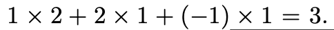 이고 L2는 x,y 둘다 $\sqrt{6}$ 입니다. x,y 사이 각의 코사인은 $1/2$ 이되고, 코사인이 1/2 인 각은 60도 입니다. 그리고 이 60이 x,y 사이의 코사인 거리입니다.

코사인 거리가 거리 측도인지를 확인해야합니다. 우리는 이 값을 0에서 180으로 정의를 했습니다. 그래서 음수값이 불가능합니다. 
두개의 백터 사이 각이 0 이면 iff 로 같은 방향을 갖습니다.
대칭도 됩니다. x,y 사이 각은 y,x 사이 각 입니다. 
삼각부등식은 물리적 이유로 잘 설명됩니다. x에서 y로 회전하는 방법은 z로 회적하고나서 y로 회전하는 방법이 있습니다. 이 두 회전의 합은 x에서 y로 바로 회전하는 것보다 작을 수 없습니다.

### 3.5.5 Edit Distance

거리는 점들이 문자열일 때 적합합니다. 두 문자열 x=x1x2.., y = y1y2.. 사이의 거리는 x를 y로 변환하는 단일 문자의 최소 삽입 및 삭제 하는 횟수 입니다.

example 3.15

x= abcde 이고 y = acfdeg 일 때 x에서 y로 변환하는 edit distance 는 3입니다.

1. b를 지운다
2. c 뒤에 f 를 삽입한다.
3. e 뒤에 g 를 삽입한다.

더 줄일 수 없으므로 d(x,y)= 3 입니다.

이 edit distance를 정의, 계산하는 다른 방식은 LSC(longest common subsequence)를 계산하는 것입니다.  x와 y의 LCS는 x와 y에서 위치를 삭제하여 생성 된 문자열이며, 그러한 방식으로 구성 할 수있는 문자열의 길이입니다.
edit distance d(x,y)는 x의 길이 더하기 y길이에서 LCS *2 를 뺀 값으로 계산할 수 있습니다.

example 3.16

edit distance 는 거리 측도입니다. 이 거리는 음수가 될 수 없습니다. 두 문자열이 같은 경우 0 이 됩니다. 이것은 대칭입니다. 삽입과 삭제의 순서는 반대로 될 수 있습니다. 삭제가 삽입이 될 수 있고 그 반대도 마찬가지입니다.
삼각부등식도 가능합니다. 문자열 s 가 문자열 t 로 바뀌는 방법은 s가 u 로 된 다음 u에서 t 가되는 방법이 있습니다. s 에서 u 로 갈 때 수정의 횟수와  u에서 t로 가는 수정의 횟수는 s서 t로 수정하는 가장 작은 수보다 작을 수 없습니다.

#### Nod-Eucliden Spaces

이 세션에서 소개된 몇개의 거리측도는 유클리드 공간이 아닙니다. 유클리드 공간의 속성은 유클리드 공간안의 점들의 평균은 항상 존재하고 그 점은 공간안에 있다는 것 입니다.
그러나 자카드 거리에서 사용한 집합의 공간을 생각해 봅시다. 두 집합의 평균이란 개념은 말이 안됩니다. edit 거리를 사용하는 문자열들의 공간도 마찬가지로, 문자열의 평균을 사용할 수 없습니다.

코사인 거리를 제시한 벡터공간은 유클리디안이 될 수도 안될 수도 있습니다. 벡터들의 컴포넌트들이 어떠한 실 수도 될 수 있다면 그 공간은 유클리안 입니다.
예를 들어 [1,2],[3,1] 이 정수 요소를 갖는 벡터 공간에서는 평균을 구할 수없습니다. 2차원 유클리안 공간의 멤버로서 그것들을 다룬다면 이것의 평균은 [2.0,1.5] 로 구할 수 있지만

### 3.5.6 Hamming Distance

벡터들의 공간이 주어졌을 때 해밍 거리를 정의 할 수 있습니다. 두 벡터의 차이가 있는 컴포넌트의 수로 정의합니다. 
해밍 거리는 명백히 거리 측도입니다.
이것은 음수가 될 수 없고, 벡터가 동일한 경우 0이 됩니다. 이 거리는  어떤 것을 처음으로 둘지 고려하는것에 의존적이지 않습니다.
삼각부등식도 만족합니다. x,z가 m개의 컴포넌트에서 차이가 있습니다. 그리고 z,y가 n 개의 컴포넌트에서 차이가 있습니다. 그러면 x와 y는 m+n 보다 더 크게 차이날 수 없습니다.
일반적으로 해밍거리는 불린으로 사용됩니다. 그러나, 원리 상, 벡터의 컴포넌트는 어떤 집합이든 사용할 수 있습니다.

example 3.17

10101 과 11110 사이 거리는 3 입니다. 여기서 2,4,5번 째 컴포넌트가 차이를 갖습니다.

---

