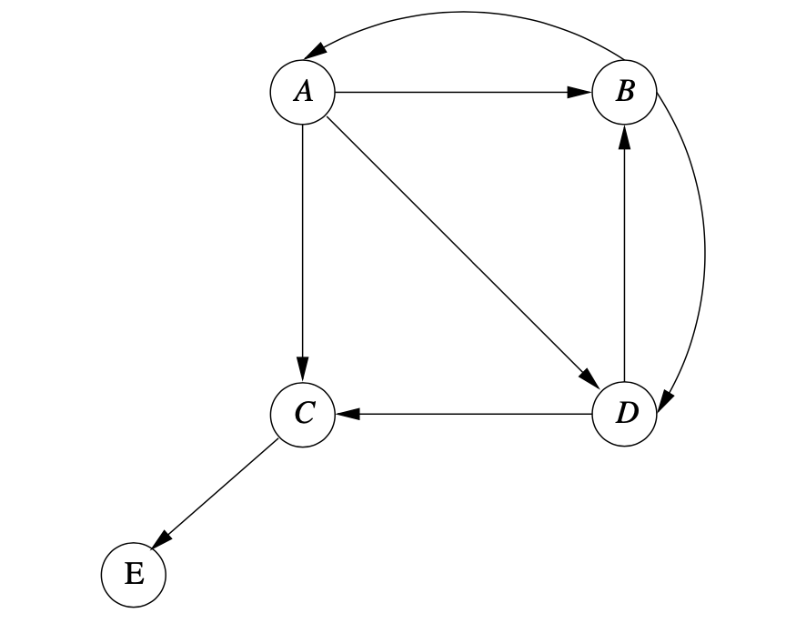
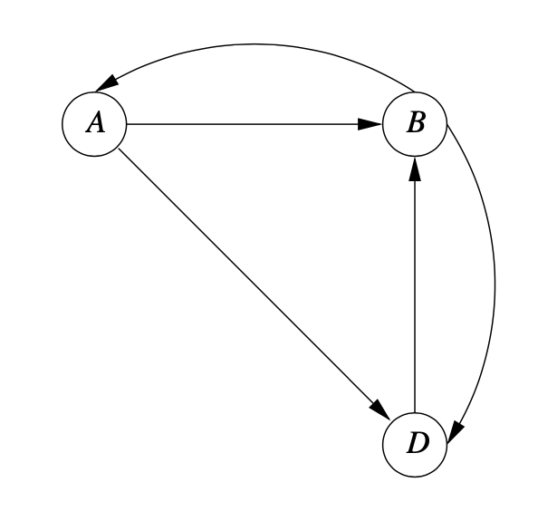
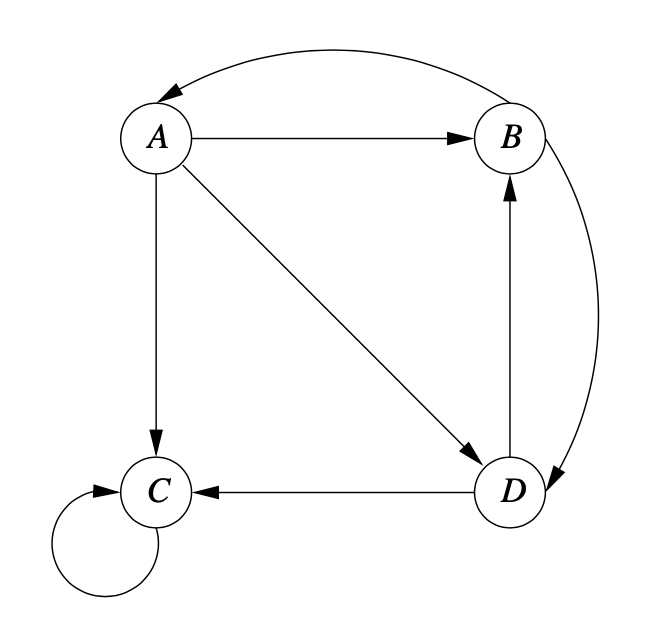
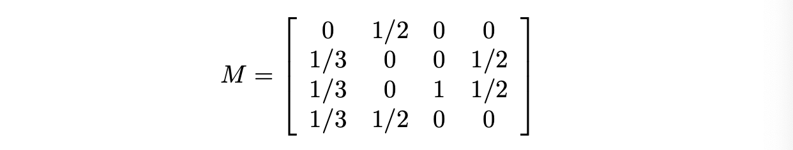
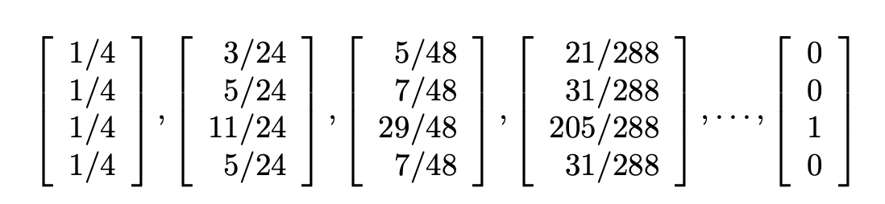
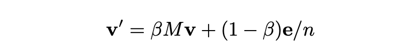
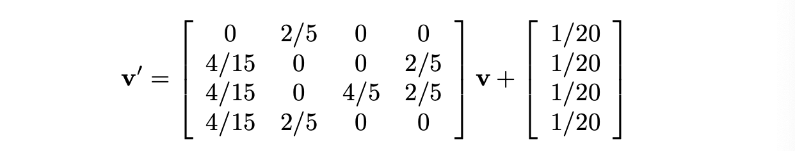
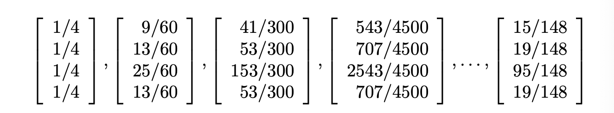

# Link Analysis

최근 우리의 삶의 가장 큰 변화는 구글과 같은 검색 엔진을 통해 효율적이고 정확한 웹 검색이 가능해졌다는 것입니다. 구글이 첫번째 검색 엔진은 아니지만 쓸모없은 스팸들을 처리한 첫번째 검색 엔진입니다. 구글이 만들어낸 혁신은 PageRank 라고 불리는 엄청난 기술적 혁신입니다. 여기서는 페이지랭크에 대해 설명하고 어떻게 효율적으로 계산되는지에 대해 다릅니다. 

아직 웹을 유용하게 만들고자 하는 사람과 사적인 목적으로 이용해먹을라는 사람 간 전쟁은 끝나지 않았습니다. 페이지랭크가 검색엔진의 필수적인 기술로 세워졌을 때, 스패머들은 패이지랭크를 조작하는 방식을 만들어냈습니다.(link spam이라고 불립니다.) 이러한 발명은 TrustRank와 다른 PageRank를 방어하는 방식이 나오도록 만들었습니다. 

 

## 5.1 PageRank

페이지랭크의 정의에 동기부여하기 위해 검색엔진의 역사부터 시작했다. 웹 페이지의 중요성을 평가하는 툴인

'random sufers'의 아이디어를 도입하여 왜 페이지랭크가 효과적인지 설명합니다. 그다음 taxation 이나 랜덤서퍼의 재활용하는 기술을 도입하여 특정 웹 구조에서 발생하는 문제를 해결합니다.

### 5.1.1 Early Search Engines and Term Spam

구글 이전에 많은 검색엔진이 있었습니다. 그것들은 웹을 크롤링하고 각 페이지에서 찾은 inverted inex에서 용어를 리스트로 만들었습니다. inverted index는 용어가 주어졌을 때 용어가 나타난 위치를 모드 찾아주는 걸 쉽게 만드는 데이터 구조입니다. 

검색 쿼리가 발생하면, 그 단어가 있는 페이지들은 inverted index에서 부터 추출되고 페이지 안에 있는 용어들의 사용을 반영하여 랭크됩니다. 그래서 헤더에 있는 페이지는 다른곳에 있는 것 보다 더 관련성이 있고, 나오는 빈도에 따라서도 빈도가 높습니다. 

사람들이 검색엔진을 사용하기 시작함에 따라, 이상한 사람들이 검색엔진을 이상하게 만들어서 그들의 페이지에 사람들이 오게끔 만들었습니다. 그래서 만약 옷을 판다면 관심도 없는 사람들도 다 들어와서 보게끔 만들 수 있습니다. inverted index에서 용어를 가지고 장난을치는 것을 term spam 이라고 합니다. 텀 스패머들의 능력은 검색엔진을 쓸모없게 만들었습니다. 

이러한 term spam 을 처리하기 위해 구글은 2가지 방안을 도입하였습니다.

1. PageRank는 임의의 페이지에서 시작하는 웹 서퍼가 현재 위치한 페이지에서 무작위로 선택한 아웃 링크를 따라갈 경우 모이는 위치를 시뮬레이션하는 데 사용되었으며이 프로세스는 여러 번 반복되었습니다. 많은 서퍼들을 가진 페이지는 더 중요한 페이지로 고려되었습니다. 구글은 검색 쿼리에 대한 대답으로 보여지는 첫번째 페이지를 결정할 때 중요한 페이지들을 더 선호했습니다.
2. 페이지의 내용은 그 페이지에 나오는 용어들 뿐 아니라 근처 연결된 페이지에서의 용어 사용에 의해 판단되었습니다. 주목할 것은 스패머들이 거짓 용어를 추가하는 것은 쉽지만, 그들의 페이지에 연결된 페이지에 용어를 추가하는 것은 어렵다는 것입니다. 

#### Simplified PageRank Doesn't Work

랜덤 서퍼의 시뮬레이션으로 페이지랭크를 계산하는 것은 시간이 소요되는 작업입니다. 단순하게 각 페이지의 인-링크의 수를 세는 것이 랜덤 서퍼가 발생한 것에 대한 대략적인 근사치라고 생각할 수 있습니다. 그러나 이렇게 하면 스패머들은 스팸 공장을 만들어 중요도를 높일 수 있습니다.

이러한 두가지 방법으로 구글을 스패머들이 사기치기 어렵게 만들었습니다. 이 대항책은 스패머들이 자신의 페이지를 많이 만들드고 movie 라는 것을 가진 링크를 가진 페이지를 그의 셔츠 페이지에 연결해야합니다. 그러나 이러한 페이지들은 페이지랭크에서 많은 중요도를 받지 못합니다. 왜냐면 다른 페이지들은 그것들과 연결되지 않았기 때문입니다. 셔츠 판매자들은 그들의 페이지들에서 많은 링크를 만들어 낼 수 있지만 이러한 페이지들은 페이지랭크 알고리즘에서 중요도를 받지 못합니다. 

랜덤서퍼 시뮬레이션이 왜 페이지의 중요도의 직관적 개념에 근사하는지 궁금해하는 것은 합리적입니다. 이 접근에 영감을 주는 2가지 관련된 모티베이션이 있습니다. 

- 웹 사용자는 그들의 발자취로 투표를 합니다. 그들은 그들이 생각한 좋거나 유용한 페이지에 위치하려는 경향이 있습니다. 
- 랜덤 서퍼의 행동은 웹의 어떤 페이지에 사용자가 방문하기 쉬운지를 나타냅니다. 사용자는 쓸모없는 페이지모다 유용한 페이지에 방문하기 쉽습니다. 

그러나 이러한 이유들괴 관련없이, 페이지랭크 방식은 경험적으로 증명되어왔습니다. 그리고 우리는 이것이 어떻게 계산되는지에 대해 세부적으로 연구할 수 있습니다. 

### 5.1.2 Definition of PageRank

페이지랭크는 웹의 각 페이지에서 실수를 할당하는 함수 입니다. 페이지의 페이지 랭크가 더 높을 수록 더 important 하도록 합니다. 페이지랭크의 고정된 알고리즘은 없고, 사실 어떤 두 페이지들의 상대적인 페이지랭크로 바꿀 수 있는 기본 아이디어의 변종이 있습니다. 우리는 이상적인 페이지랭크를 정의하고 웹 구조와 관련된 일부 실제 문제를 다루는데 필요한 수정본들에 대해 설명합니다. 

웹을 방향ㅅ그래프라고 생각해봅시다. 페이지는 노드고 p1-p2 로의 링크가 있다면 호가 생깁니다. 5.1은 웹의 작은 예시입니다. 4개의 페이지가 있습니다. A는 다른 3개의 페이지들과 연결되어 있습니다. 페이지 B는 A,D 와 연결되는 등입니다. 

Figure 5.1

랜덤 서퍼가 페이지 A에서 시작한다고 가정해봅시다. B,C,D 로 가는 링크 3개가 있고, 그래서 서퍼가 다음에 그 페이지들로 갈 확률은 1/3 입니다. 그리고 A 에 있을 확률은 0 입니다. B에서 랜덤서퍼는 다음 스텝으로 갈 확률은 1/2(A,D) 입니다. (B,C로는  0) 

일반적으로, 우리는 웹의 transition matrix 를 정의할 수 있습니다. 이것은 랜덤서퍼가 한 스텝 후에 일어나는 것을 나타냅니다. 이 행렬 M 은 n 개의 행, 열을 갖습니다. j 가 k 개의 out 아크를 갖고 i 가 그 중 하나의 페이지라면 $m_{ij}$ 는 1/k  의 값을 갖습니다. 다른 경우는 0 입니다. 

example 5.1

이러한 행렬에서, 페이지의 순서는 A,B,C,D 입니다. 그래서 첫번째 열은 A에서의 서퍼가 각 다른 페이지들에 다음에 있을 확률들ㅇ 입니다. 

랜덤서퍼의 위치에 대한 확률 분포는 열벡터에 의해 표현될 수 있습니다. j번째 열의 요소들은 페이지 j에 있는 서퍼으 ㅣ확률입니다. 이 확률이 이상적인 페이지랭크의 함수 입니다. 

동일한 확률을 가진 n 개의 웹 페이지들이 있는 어떤 곳에서 랜덤 서퍼가 시작된다고 가정해봅시다. 그러면 초기 벡터 $v_0$ 은 각 컴포넌트에 대해 1/n 을 갖게 됩니다. 만약 M 이 변환 행렬이면 바로 다음 스텝 후에서, 서퍼의 분포는 $Mv_0$ 이 됩니다. 두번째 스텝 후에는 $M^2 {v_0}$ 이 됩니다. 일반적으로 초기 벡터 v_0 에 i번 M 를 곱하는 것이 i 번째 스텝 후의 서퍼의 분포가 됩니다. 

벡터 v 에 M 을 곱하는 것이 왜 다음스텝에서의 분포를 의미하는지에 대해 봅시다. 랜덤서퍼가 다음스텝에서 노드 i 에 있을 확률 x_i 는 $\Sigma_j m_{ij}v_j$ 입니다. 여기서 m_{ij}는 노드 j 에 있는 서퍼가 다음 스텝서 노드 i 로 이동할 확률입니다. 그리고 v_j 는 이전 스텝에서 서퍼가 노드 j 에 있을 확률입니다. 

이러한 행동의 정렬은 마코프 프로세스라는 고전적인 이론의 예시십니다. 서퍼의 분포는 다음 조건을 만족하는, v = Mv 인 limiting 분포 v 에 가까워진다고 알려져 있습니다. 

1. 그래프는 *strongly connected* 이다. : 어떤 노드든 다른 노드로 갈 수 있다.
2. dead ends 가 없다. : arc out 이 없는 노드가 없다.

M을 여러번 곱한 분포가 안바뀔 때 한계에 도달합니다. 다른 말로는, limiting v는 M의 고유 벡터입니다.( 고유벡터 v는 $v = \lambda M v$ 를 만족하므로) 사실, M 이 확률적(stochastic) 해서, 각 칼럼의 합은 1 이됩니다. 그래서 v는 *principal* eigenvector  입니다. (고유값 들 중 가장 큰 고유값의 고유벡터) M이 stochastic 이기 때문에, principal eigenvector 와 관련이 있는 고유값이 1 입니다. 

M 의 principal 고유벡터는 서퍼가 오랜시간 후에 어디에 있을지에 대해 알려줍니다. 페이지랭크의 직관에 대해 생각해 봅시다. 서버는 더 중요한 페이지에 있을 가능성이 높습니다. 우리는 M의 principal eigenvector 를 계산할 수 있습니다.  초기 벡터v_0 과 M을 변화가 거의 없을 때 까지 곱합니다. 실제 웹에서는 50~75 번 정도 반복하면 double-precision arithmetic 의 에러 limit 안에 수렴합니다. 

#### Solving Linear Equations

만약 5.2 처럼 4개의 노드가 있을 때 가우시안 소거법을 사용하여 방정식을 푸는 방법을 생각할 수 있습니다. 이런 경우에는 어떤 제약이 있는지 생각해 볼 수 있습니다. 실제 상황에서는 수억개의 노드가 있고, 가우시안 소거법은 부적합합니다. 가우시안 소거법은. cubic 시간이 걸립니다. 그래서 이런 규모의 데이터를 가지고 방정식을 풀 수 있는 유일한 방법은 이전에 제시한 것처럼 반복하는 것입니다. 반복법(iteration)이 각 라운드마다 quadratic 이긴하지만, 사실 M이 매우 sparse 하고 이 이점을 통해 속도를 높일 수 있습니다. 평균적으로 페이지 당 10개의 링크가 있습니다. (10개의 nonzero 엔트리)

또한, 페이지랭크 계산과 선형방정식을 푸는 것에는 또 다른 차이가 있습니다. 방정식 v = Mv 는 는 무수히 많은 해를 갖고있습니다. 상수 c 에 v의 요소를 곱하여 어떤 해도 만들 수 있습니다. 여기서 컴포넌트의 합이 1 이라는 제약을 넣어서 유일해를 얻을 수 있습니다. 

### 5.1.3 Structure of the Web

Fig 5.1처럼 웹이 strongly conntected 이면 좋을 것입니다. 그러나 실제로는 그렇지 않습니다. 초기 웹에 대한 연구는 웹 구조가 Fig 5.2 와 같이 생겼다는 것을 보였습니다. 큰 강력하게 연결된 구성 요소 (SCC)가 있었지만 거의 다른 여러 부분이있었습니다.

1. In-component 는 링크를 따라 SCC 에 도달할 수 있는 페이지로 구성되었다. 그러나 SCC가 해당 페이지에 도달할 수 없습니다. 
2. out-component 는 SCC가 도달할 수 있지만 해당 페이지가 SCC 로 가지는 못합니다.
3. Tendrils 은 두가지 종류가 있습니다. 하나는 in-component 이 도달할 수 있는 페이지들로 구성되어 있습니다.(in으로 갈 수는 없습니다.)
   다른 tendril은 out-component 로 도달할 수 있지만 out에서 갈 수는 없습니다.   

추가적으로 소수의 페이지들은 다음과 같이 있습니다. 

1. Tubes 는 in component 가 도달할 수 있고 out-componet 로 갈 수 있습니다. 그러나 SCC 에 도달하거나 SCC 에서 올 수 없습니다.
2. Isolated components는 큰 컴포너트로 갈 수도 없고 거기서 오지도 않습니다. 

이러한 구조들의 일부는 Markov-provess iteration 이 리밋으로 수렴하기 위해 필요한 가정들을 위반합니다. 예를들어 랜덤 서퍼가 out-component 로 들어 갈 때 서퍼는 거기를 떠날 수 없게 됩니다. 그 결과 SCC 나 인컴포넌트에서 시작한 서퍼는 나중에 아웃컴포넌트나 인의 tendril off 에 있게 됩니다. 그래서 SCC 안에 없는 페이지나 인컴포넌트에 페이지느 어떠한 확률이여도 결국엔 그곳에 있지 못하게 됩니다. 만약에 우리가 이 확률을 페이지의 중요도를 판단하는 것으로 생각해보면, SCC 나 인컴포넌트에 어떠한 중요도도 없다고 결론지을 수 있습니다.

그래서 페이지랭크는 이러한 상황을 방지하기 위해 일반적으로 수정해서 사용합니다. 실제로 우리가 해결해야할 문제는 2개가 있습니다. 우선 dead end 입니다. 이는 페이지의 out 링크가 없는 경우입니다.  그러한 페이지에 도달하는 서퍼는 사라지고, 결국 한계에 도달 할 수있는 페이지는 PageRank를 가질 수 없습니다. 두번째 문제는 다른 어떤 페이지로도 갈 수 없는 아웃링크를 가진 페이지의 그룹이 있는 것 입니다.  이러한 구조를 spider traps 이라고 합니다. 이 두 문제들은 taxation 이라고 불리는 방법에 의해 해결할 수 있습니다. (랜덤 서퍼가 웹을 떠날 확률이 한정되어 있고, 각 페이지에서 새로운 서퍼가 시작된다는 상황에서) 여기서 케이스 별로 다루겠습니다. 

### 5.1.4 Avoiding Dead Ends

아웃링크가 없는 것을 데드엔드라 합니다. 만약 데드엔드르 허용할 때 웹의 변환 행렬은 더이상 확률적이지 않습니다. 이 경우 특정 칼럼의 합이 1이 아니라 0이 될 수 있게됩니다. 열의 합이 최대 1 인 행렬을 substochastic 이라 합니다. 만약 substochastic 행렬 M 으로 M^iv 를 계산할 때, 벡터의 일부 혹은 전체가 0이 되데 됩니다. 이것을 웹에서는 중요도 drain out 이라고 하고, 이 상황에서는 페이지의 상대 중요도에 대한 정보를 얻을 수 없게 됩니다. 

데드엔드를 다루는 2가지 방법이 있습니다.

1.  데드엔드 노드와 데드엔드로 가는 호를 그래프에서 빼버립니다. 이렇게 하면 더 많은 데드앤드를 만들 수 옫 있습니다. (데드엔드 빼서 생기는 데드엔드) 그러나, 결국 SCC를 얻게 됩니다. (SCC 는 데드엔드가 없습니다.) 그림 5.2 에서 이 방식을 쓰면 SCC 와 인컴포넌트, isolated 컴포넌트만 남습니다. 
2. 랜덤 서퍼가 웹에서 움직이기 위한 프로세스를 수정할 수 있습니다. 이 방식(taxation)은 spider trap 문제 또한 해결 할 수 있스빈다. 5.1.5세션에서 다룹니다. 

만약 첫번째 방식을 사용하면 제귀적으로 데드엔드의 삭제가 됩니다. 그 후에 남아 있는 그래프를 taxation 과 같은 방법 등을 사용하여 남은 그래프 G 를 해결합니다. 그러고 G의 노드에 대한 페이지랭크 값을 유지한 채 그래프를 복구합니다. G에 있지 않지만 G에있는 선행 작업이있는 노드는 모든 선행 작업 p에 대해 p의 PageRank p를 전체 그래프에서 p의 후속 작업 수로 나눈 것으로 계산하여 PageRank를 계산할 수 있습니다.페이지 랭크가 계산된 G에 있지 않은 다른 노드들이 있을것입니다. 이러한 것들은 동일한 과정으로 계산이 될 수 있습니다. 결국 G 밖의 모든 노드들의 페이지 랭크가 계산됩니다. 삭제된 순서의 반대로 순서로 계산됩니다.

그림과 같은 상황을 가정해 봅시다. 

여기서 E와 C 은 데드엔드가 됩니다. 이를 제거한 그래프 G 를 만듭니다.

이 그래프에서 기존 방식대로 페이지랭크를 계산하면 $[\frac{2}{9} \frac{4}{9} \frac{3}{9}]^T$ 이 나옵니다. 이 페이지링크를 활용하여 C 의 페이지 링크를 구합니다. C를 다시 만드는 경우 predecessor 인 A 에서 1/3, D 에서 1/2 의 아웃링크 기여가 생깁니다.  그러므로 C 는 1/2 * 2/9 + 1/2*3/9 = 13/54 가 됩니다. E의 경우 C 에서 하나만 있으므로 동일한 값을 갖게 됩니다.

### 5.1.5 Spider Traps and Taxation

스파이더 트랩은 데드엔드는 아니지만 밖으로 나가는 arc 이 없는 노드들의 집합입니다. 이러한 구조는 의도적이든 비의도적이든 웹에 나타날 수 있고, 이는 페이지 랭크 계산이 스파이더 트랩안에서만 일어나도록 만듭니다. 

example 5.5

이 그림에서 스파이더 트랩은 C 하나 입니다. 일반적으로 스파이더 트랩은 많은 노드를 갖고 있습니다. 위 그림을 변환 행렬로 바꾸면

이와 같이 됩니다.

만약 기존 방식대로 페이지 랭크 계산을 반복한다면 다음과 같은 결과를 얻게 됩니다. 

예상한대로 모든 페이지랭크가 C 에 있게 됩니다. 랜덤서퍼가 한번 가면 나오질 못합니다. 

이와 같은 상황을 피하기 위해 페이지 랭크 계산을 수정합니다. 각 랜덤 서퍼에 무작위 페이지로 가는 teleporting 의 확률을 부여합니다. 여기서 확률을은 out-link 보다는 작아야 합니다. 반복작업에서 페이지랭크의 새로운 백터 추정치인 v' 를 계산합니다. 

여기서 $\beta$ 는 상수이고 일반적으로 0.8~0.9 로 사용합니다. e 는 모든 요소가 1 로 된 벡터 입니다. 

첫번째 텀은 베타를 갖고 랜덤 서퍼가 현재 페이지로부터의 아웃링크에 따라 가는 확률입니다. 두번째 텀은 1-b/n 값을 가진 컴포넌트들의 각각의 벡터 이고 1-b 의 확률을 가지고 랜덤페이지로 들어가는 것을 나타냅니다. 

만약 데드앤드가 없다면 새로운 랜덤서퍼가 진입하는 확률은 현재페이지로 부터의 링크를 따르지 않을 확률과 같습니다. 이 경우에는 서퍼를 링크를 따르거나 랜덤페이지로 텔레포트를 허용하는 것으로 결정하는 것을 시각화하는 것이 합리적입니다. 그러나 데드앤드가 있는 경우 서퍼가 막다른 길에 갈 3번째 가능성이 있습니다. 2번째 텀이 벡터 v 의 컴포넌트 합에 대해 종속적이지 않기 때문에 웹에서 서퍼가 동작하는 특정 부분이 항상 존재하게 됩니다. 데드엔드들이 있을 때 v의 컴포넌트들의 합은 1보다 작을 순 있지만 0이 되면 안됩니다. 

example 5.6

그림 5.6 의 경우에서 에서 베타를 0.8로 두어 방정식을 다음과 같이 바꿀 수 있습니다. 

각 요소들에 4/5가 곱해진 M 과 베타를 통합합니다. (1-b)e/n 은 1/20 입니다. (1-b = 1/5,n = 4) 반복을 하다보면 다음처럼 됩니다. 

스파이더 트랩이 있어서 C 는 기존 페이지링크 값의 반 이상을 자체적으로 확보했습니다. 그러나 제한 효과로, 각 노드들도 페이지랭크의 일부를 갖게 됩니다. 

### 5.1.6 Using PageRank in a Search Engine

웹의 부분에 대한 페이지랭크 벡터를 어떻게 계산하는지 본 후 이 정보가 어떻게 사용되는지 확인해야 합니다. 각 서치앤지는은 비밀 공식을 갖고있습니다. 페이지들을 사용자에게 보여주기 위해 어떤 순서로 결정하는지에 대한, 구글은 250개가 넘은 페이지의 속성을 사용합니다. 

우선 랭킹에 대해 고려되기 전에, 페이지는 적어도 하나의 쿼리 단어를 갖습니다. 일반적으로 속성의 가중치를 두는 것은 만약 모든 검색 용어가 제시되지 않는 다면 페이지는 매우 낮은 찬스를 갖습니다.(상단에 위치하는). 자격있는 페이지들 중에 페이지랭크의 중요도가 계산이 됩니다. 다른요소들은 검색 단어가 헤더나 그 페이지로의 링크 등의 위치에 있는지 유무 등을 포함합니다. 

