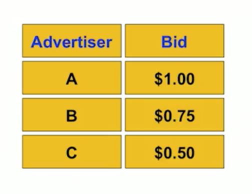
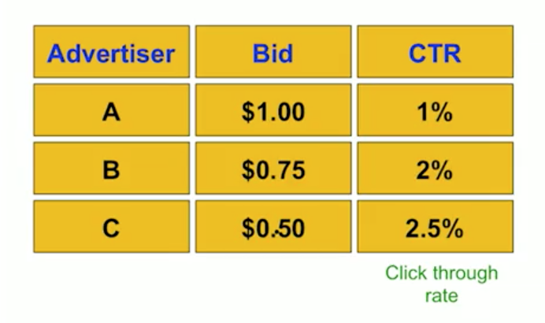
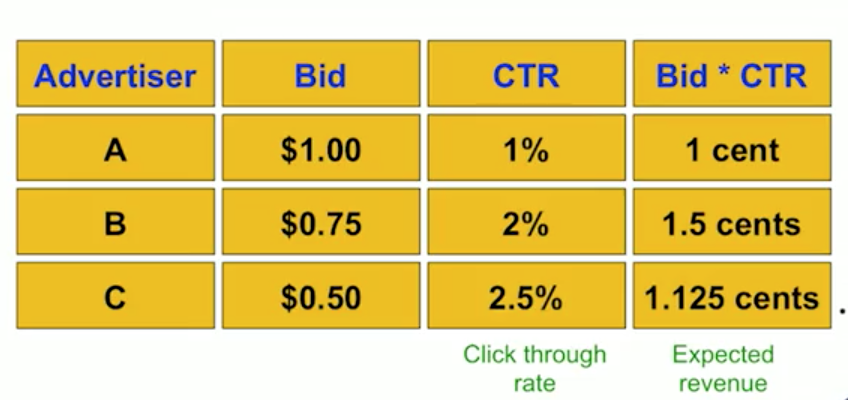
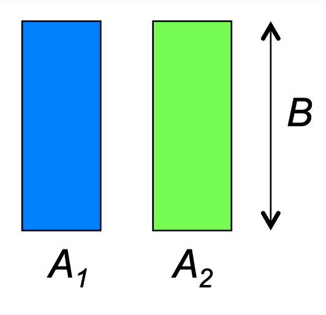
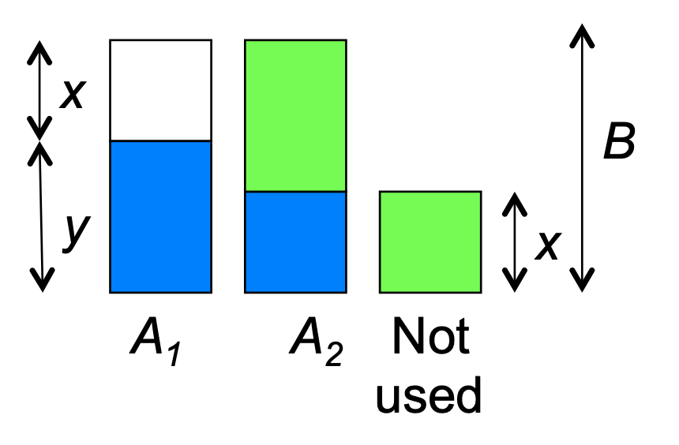

초기 웹사이트의 베너 광고에 대해 생각해 봅시다.  
웹사이트들은 이 베너 광고를 CPM 을 사용하여 광고 가격을 사용했습니다.  
CPM(cost per thousand impression) 이란 1000개의 노출(impression) 당 코스트를 의미합니다.  

웹사이트 광고는 불특정 다수에게 보여지므로 사람(target) 마다 광고 효율이 크게 차이가 납니다.   
그래서 CPM 대신 광고를 클릭하는 것에 대한 요금, ROI 를 사용하였습니다. 

그리고 웹페이지의 특성에 따라 그 웹페이지의 사용자에 맞춘 광고 방식이 도입되었습니다.  
이런 방식을 Peformance-based Advertising 이라고 합니다. 

이러한 방식에서  
검색엔진의 쿼리에 따라 어떤 광고를 넣을지가 이번 포스팅의 내용입니다.

이 문제 상황을 adwords Problem 이라고도 합니다.  

쿼리가 검색엔진에 스트림으로 들어오고  
쿼리는 예측할 수 없습니다.  
각 쿼리가 들어오자마자 광고주들은 광고비를 제시하고  
우리는 적절한 광고를 선택해서 광고 입찰가을 최대화해야합니다..  
즉, online 알고리즘입니다.

다음과 같은 상황을 가정해봅시다.  
하나의 쿼리에 대해 다음과 같이 3개의 광고를 선택할 수 있습니다. 

A,B,C 에서 제시한 광고는 클릭에 따른 입찰가에 차이가 있습니다.  
이러한 상황에서는 greedy로, 가장 비싼 A 를 선택하는 것이 합리적입니다.

만약 각 광고마다 클릭빈도가 측정되어 다음과 같은 정보를 얻었다고 가정해봅시다.

이 정보를 갖고 있다면  
입찰가와 CTR(클릭 비율) 을 사용하여 기대 수익을 얻을 수 있고,  
이를 기반으로 B가 가장 높은 수익이 기대되어 B를 선택할 수 있습니다.

그러나 실제 문제 상황에서는 몇가지 제약이 더 있어서 복잡합니다. 

Adwords 문제를 정리하면 다음과 같습니다.

- 각 쿼리에 대해 advertiser의 bid 의 집합이 주어집니다.
- advertiser-query 쌍에 대해 CTR 이 주어집니다.
- 각 advertiser는 광고를 위한 예산이 한정되어 있습니다.
- 각 쿼리를 가지고 보여줄 수 있는 광고의 수는 한정되어 있습니다.

각 쿼리에 대해 advertiser들은 다음과 같이 수행해야합니다.

- 쿼리에 대해 advertiser들은 가격을 제시합니다.
- 쿼리의 광고가 클릭될 때 지불할 예산이 있어야 합니다.
- 쿼리 당 광고의 수 보다 많이 광고할 수 없습니다.

위 문제를 푸는 알고리즘이 Balance Algorithm 입니다.

우선 다음과 같은 가정으로, 간단한 버전을 살펴봅시다.  

- 광고베너는 하나만 존재합니다.
- 모든 advertiser들의 예산은 B 로 동일합니다.  
- 모든 광고의 CTR 이 동일합니다.  
- 각 광고의 bid는 1 로 동일합니다.

위 상황에서 그리디 알고리즘을 사용해보면,  
각 쿼리마다 bid 가 1인 광고를 선택해서 보여줍니다.  
advertiser 마다 예산이 B 로 한정이 되어있기 때문에  
최악의 경우 competitive ratio 가 1/2 가 됩니다  

대신 Balance 알고리즘을 사용합니다.

두명의 advertiser A,B 가 있다고 가정합시다.  
A는 쿼리 x 에 입찰을하고 B는 x,y 에 입찰을 합니다. (예산은 둘다 4 입니다.)

쿼리 스트림이 다음과 같이 주어집니다.  
x x x x y y y y 

balance 알고리즘에서는 A,B의 예산이 맞도록 조절을 합니다.

처음 x의 경우 임의로 A 를 할당합니다. (예산 A:3,B:4)  
두번째 x 에서는 예산의 밸런스를 맞추기 위해 B 를 할당합니다.  (예산 A:3,B:3)  
세번째 x 에서는 임의로 A를 할당합니다. (예산 A:2,B:3)  
네번째 x 에서는 예산의 밸런스를 맞추기 위해 B 를 할당합니다.  (예산 A:2,B:2)  
다섯번째 여섯번째 y 를 B 에 할당하고, 7,8번째 는 예산이 없으므로 중단합니다.

위 상황에서 그리디를 사용한 경우 1/2의 ratio 를 얻지만  
밸런스 알고리즘의 경우 3/4 의 ratio 를 얻었습니다.

이제 이 밸런스 알고리즘을 분석해 봅시다.

밸런스는 적어도 하나의 예산을 소진시킵니다. 아닌 경우에는 다른 쿼리를 더 할당할 수 있습니다.

두명의 advertiser $A_1,A_2$ 가 주어졌다고 가정해 봅시다.  
그리고 각 B의 예산을 갖고 있습니다.  

파란색은 둘다 초록색을 $A_2$ 에 사용할 수 있는 쿼리라 하면  
최적의 상황에서는 위 그림처럼 두개의 예산이 모두 쓰여  
수익이 2B 가 됩니다. 

밸런스 알고리즘을 사용하면

위와 같이 둘 중 하나의 예산은 소진되고   
하나의 예산은 일부 남게됩니다.  
그림에 따라 수익은 B + y 입니다.

이 분석에서는 y가 1/2 B 보다 높다는 것을($y \geq \frac{B}{2}$) 보이고자 합니다.

두가지 상황을 나눠서 봅시다.

1. B/2 이상의 파란색 쿼리가 $A_1$ 에 할당된 경우, 당연히 $y \geq \frac{B}{2}$ 입니다. 
2. B/2 이상의 파란색 쿼리가 $A_2$ 에 할당된 경우  
   $A_2$ 에 마지막 파란색 쿼리가 할당되는 상황을 생각해보면  
   $A_2$ 의 사용되지 않은 예산이 $A_1$ 의 사용되지 않은 예산보다 많아야합니다.(밸런스)  
   이것은 $A_2$ 에 할당된 것이 $A_1$ 에 할당된 것보다 적다는 것을 의미합니다.  
   이 상황은 $A_1$에 할당된 것이 $A_2$ 에 할당된것 (B/2) 보다 많은 상황이므로  
   $y \geq \frac{B}{2}$ 가 성립합니다.

Balance에서 $y \geq \frac{B}{2}$ 이 성립하므로    
Competitive ratio $ \frac{|M_{balance|}{|M_{opt|} \geq 3/4 $ 가 성립합니다. 

위 상황은 두명의 advertiser 가 있을 때의 Competitive ratio 를 구한것이고  
일반적인 경우 $1- \frac{1}{e} \approx 0.63$ 가량 나옵니다.

결과적으로 이 adword 문제 상황에서는  
greedy 알고리즘보다 Balance 알고리즘이 좋은 성능을 보여줍니다.

 

우선 CTR 을 추정하는 작업부터 수행해봅시다.   
여기도 몇가지 이슈가 있습니다.   

- CRT 은 위치에 종속적입니다.  
  : 만약 광고가 상단과 하단 두개가 존재한다면,  
  위치에 따라 같은 광고라도 CTR 의 차이가 있습니다.
- Explore vs Exploit  
  : 이미 CTR 을 갖고 있을 때   
  이를 사용하여 최적의 광고를 내보낼지, 아니면 CTR 을 업데이트하기 위해 새로운 것을 시도할지 정해야합니다. 