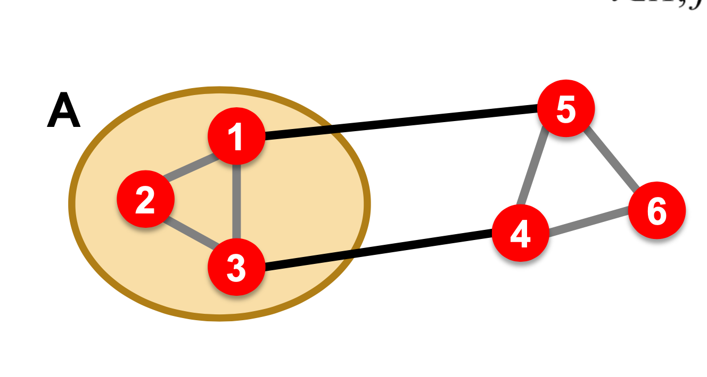
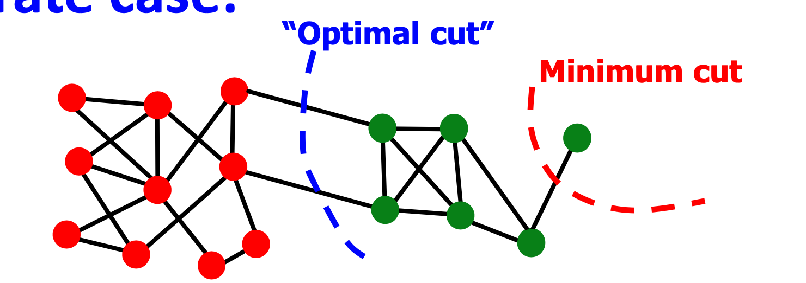
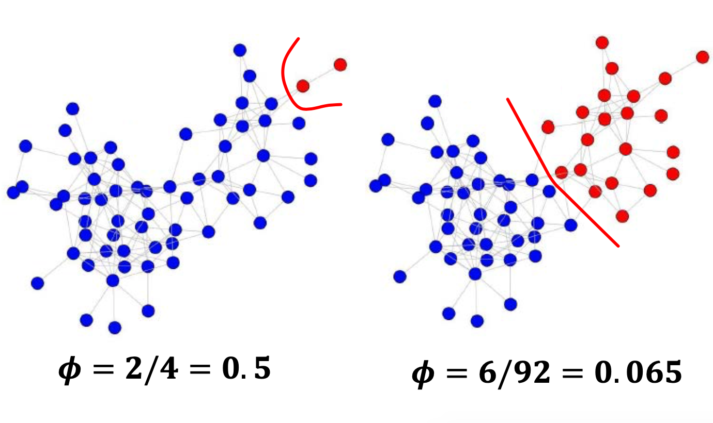

그래프 구조에서 좋은 클러스터란 무엇인지 생각해봅시다.  

직관적으로 생각해보면,  
클러스터 안에 있는 노드들끼리는 서로 연결이 잘 되어 있고,(within cluster)  
다른 클러스터 사이 연결은 최소한으로 되는 것을(between cluster)   
좋은 클러스터라고 정의 할 수 있습니다.

이 정의를 표현하기 앞서  
클러스터 특성 표현하는 함수를 만들어봅시다.  

그림과 같이

그래프의 노란 색 부분을 기준으로  
노드들은 하나의 클러스터에 속하게 됩니다.  
그리고 그 노드 중 클러스터 외부의 노드와 연결되는 엣지가 존재합니다.   
클러스터에서 이 엣지들에 대한 용어를 정의할 수 있습니다.  

'Cut' 이란  
엣지 중 하나의 포인트(노드)만 클러스터에 포함되는 엣지들의 집합입니다.   
한쪽의 포인트는 자신의 클러스터에 있고 다른 포인트는 다른 클러스터에 있습니다.

클러스터 A 에 대한 cut 은,  
엣지의 하나의 포인트는 A에, 나머지 포인트는 A의 외부에 있는 엣지를 표현합니다.  
그리고 함수 cut(A) 는 그 엣지들의 weight 의 합으로 정의합니다.

$$ cut(A) = \underset{i\in A,j\notin A}\sum w_{ij}$$      

각 엣지마다 weight 가 1 이라면,  
단순하게 cut 에 포함된 엣지의 수를 나타냅니다.  

위 그림과 의 경우,  
A의 cut 은 (1,5) 엣지와, (3,4) 엣지 두개가 존재하여  
$$cut(A)= 2$$ 가 됩니다.  

이 cut 함수를 클러스터 분할의 기준이라고 생각해 봅시다.  
cut 의 수가 적다는 것은 클러스터 사이 연결이 적다는 의미이고,  
앞서 말한 좋은 클러스터의 정의와 일부 부합합니다. 

그러면 cut이 최소화 되는 분할을 해봅시다.   
위의 그림과 같은 경우는 적합하게 수행될 수 있습니다.  
그러나 다음과 같은 상황이 발생합니다.  

직관적으로 생각하기에는 중간에 있는 컷이 분할에 적합합니다.  
그러나 cut의 수를 기준으로 하는 경우  
노드 하나로 구성된 클러스터가 cut의 최소를 갖어  
그림과 같이 분할이 됩니다.

이 상황, cut 을 사용하여 클러스터를 나누는 작업의 문제는  
클러스터의 외부 연결만 고려하고,  
클러스터 내부의 연결에 대해 고려하지 않는다는 것입니다.

때문에 클러스터 내부의 연결까지 고려한 측도(metric)이 필요합니다.

새로운 분할 기준으로서 Conductance 를 사용합니다.  
이는 클러스터의 밀도(내부연결)과 외부 연결을 고려하여 다음과 같이 표현합니다.  
$$\phi(A) = \frac{cut(A)}{min(vol(A),2m-vol(A))} $$    

이는 cut 에 내부 클러스터의 엣지의 수(weight)를 나눈 값입니다.   
$vol(A)$ 란 적어도 하나의 끝점이 클러스터 A 에 있는 엣지의 weight 총 합 입니다.  
$$vol(A) = \underset{i \in A} \sum d_i$$ 

여기서 m 은 그래프의 전체 엣지의 수 이고,  
클러스터의 볼륨이 반 이상이 넘어가는 경우 패널티를 주기 위해  
최소값으로 설정한 것입니다.

이 conductance 점수를 사용해 보면

다음과 같은 결과를 얻습니다.  
이 점수가 낮을수록 클러스터가 잘 나눠졌다고 판단할 수 있습니다.