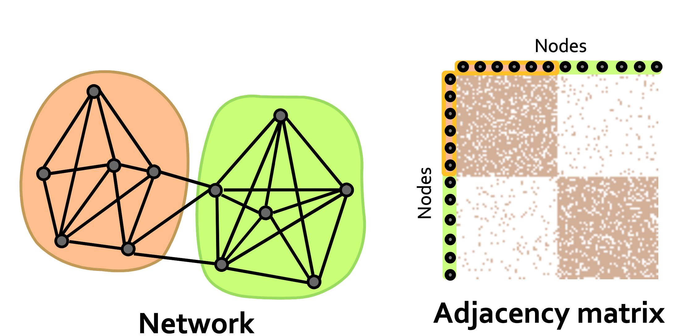
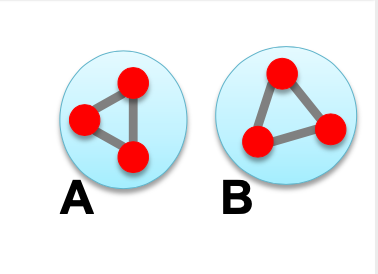
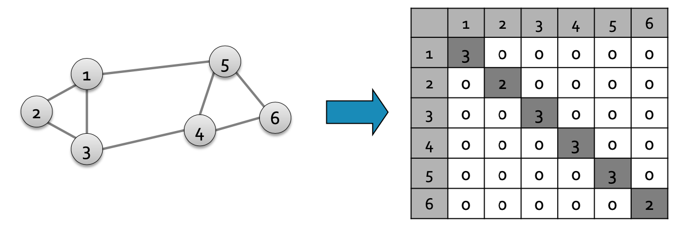

이전 포스팅의 Conductance 로 그래프를 분할하는 최적의 cut을 찾는 문제는  
NP-hard 문제로 연산이 많이 필요합니다.  
노드를 하나씩 추가하면서 cut과 volumn 을 구해서 비교해야합니다.  
때문에 그래프가 큰 경우 사용하기 어렵습니다.

그래서 행렬의 특성을 활용한 spectrum partitioning 을 사용합니다.

이번 포스팅에서는 spectrum partitioning 를 설명하기 위해 필요한 개념을 짚어보겠습니다.

## Cluster and Matrix

클러스터를 행렬의 관점에서 봅시다. 

2개의 클러스터를 가진 그래프를 인접행렬로 표현하면  
다음과 같습니다.

인접행렬의 정의에 따라  
노드끼리 연결되어 있으면 엔트리가 1, 없으면 0 이고   
클러스터 별로 행렬을 정렬하여 표현하면  
위 그림과 같이 두개로 나눠집니다.

그래프 G의 인접행렬 A 있고  
그래프의 노드 i 에 대한 값이나, 라벨을 나타내는 $x_i$ 가 있다고 가정합니다.  
x 는 전체 노드 수 n 개 만큼의 차원을 가진 벡터입니다.

## Spectrum

인접행렬 A 와 라벨 벡터 x 의 곱에 대해 생각해 봅시다.  
$n\times n$ 차원의 행렬과 $n$ 차원의 벡터의 합이므로,  
n 차원의 벡터 y 가 나옵니다.

$$ A \cdot x=  \begin{bmatrix} a_{11} &\cdots & a_{1n}\\ \vdots & \ddots & \vdots \\ a_{n1}& \cdots & a_{nn} \end{bmatrix}  \begin{bmatrix} x_1\\ \vdots \\ x_n \end{bmatrix} 
=
\begin{bmatrix} y_1\\ \vdots \\ y_n \end{bmatrix}  $$ 

이 벡터 y 의 의미에 대해 생각해봅시다.  
우선 y 중 하나의 행인 $y_i$ 만 보면,   
$y_i$ 는 A의 i 번째 행의 요소와, 벡터 x 의 요소 값을 곱해서 더한 값 입니다.   

여기서 A의 i 행은  
i 번째 노드와 연결된, 이웃노드들의 인덱스에 해당하는 위치에는 1 이있고, 연결되지 않은 위치는 0으로 되어 있습니다.  
그리고 x 를 곱하여 이웃노드에 해당하는 x 값만 남게됩니다. 

즉, $y_i$ 는 노드 i 의 이웃 노드들의 라벨의 합이 됩니다.   
$$y_i = \underset{(i,j)\in E}\sum x_j$$

만약 이 행렬에 관한 식이 다음과 같은 형태로 나온 경우를 생각해봅시다.    
$$A\cdot x = \lambda x$$  
x가 행렬 A 의 고유벡터인 경우입니다.

이 고유벡터를 가지고 그래프의 특성을 분석할 수 있습니다.

여기서는 스펙트럼(spectrum) 을 사용합니다.  
스팩트럼이란, 고유값의 크기(magnitude) 순으로 나열한 고유벡터들입니다.  
$\Lambda = \{\lambda_1,\lambda_2, \dots , \lambda_n\}$ 

행렬의 고유값을 가지고 어떻게 그래프 특성을 분석할 수 있는지에 대해 살펴보겠습니다.  

모든 노드가 degree d 를 갖는 그래프 G 를 가정해 봅시다.(d-regular)  
이 그래프의 인접행렬은 A 이고   
x 를 1로만 구성된 벡터라고 봅니다. $x = (1,1,\dots,1)$  

그러면 $$A\cdot x = (d,d,\dots,d)$$ 가 되고,  
이는 고유값 d 와 고유벡터 x 로 구성됩니다. ($\lambda \cdot x$)

이제 그래프가 2개의 클러스터 C,D를 갖고,  
각자의 노드들은 d 개의 degree 를 갖는 상황을 가정해봅시다.

$x_C$ 는 클러스터가 C인 노드의 라벨을 나타내는 벡터이고,  
$x_D$ 는 클러스터가 D인 노드의 라벨을 나타내는 벡터입니다.

클러스터 별로 행렬이 정렬되었다면,  
$x_C = (1,\dots,1,0,\dots,0)$ 와 같이 C의 수 만큼은 1이되고 그 이후는 0이되는 벡터입니다. $x_D$ 는 이와 반대로 됩니다.    
이 벡터에 행렬을 곱하면  
$A\cdot x_C = (d,\dots,d,0,\dots,0)$   
$A\cdot x_D = (0,\dots,0,1,\dots,1)$

이 두가지 식에서 고유값은 $\lambda = d$ 로 동일하게 됩니다. 

즉, 고유벡터 $x_C$ 와 $x_D$ 는 동일한 고유값 d 를 갖습니다. 

이 결과에 대해 생각해보자면  
그래프 G 에서 C와 D 는 완전히 분할되어 있었고,  
이 둘을 나타내는 고유벡터들의 고유값이 일치했습니다.   

만약 C 와 D 사이 연결이 있다면,  
이 고유값에 차이가 생길 것입니다.   
직관적으로 고유값이 유사할수록  
클러스터 분할이 잘되었다고 볼 수 있습니다.

위 예시는 d-regular graph의 가정하에 있습니다.  
실제 그래프는 d-regular 가 아니므로  
인접행렬 대신 라플라시안 행렬을 사용합니다.

스펙트럼을 사용해 그래프를 분할하기 앞서  
몇가지 행렬들에 대해 짚고 넘어가겠습니다. 

### 인접행렬, Adjacency Matrix (A) 

인접행렬은 노드 i,j 사이에 엣지가 있으면 1, 없으면 0 으로 정의되는 행렬입니다.  
방향이 없는 경우 symmetric 행렬이고  
이 행렬의 고유벡터들은 실수이며, 벡터 간 직교(=orthogonal) 합니다. 

### 차수행렬, Degree Matrix (D)

대각행렬이며, 각 노드의 차수를 성분으로 갖습니다.  

### 라플라시안 행렬, Laplacian matrix (L)

차수행렬에 인접행렬을 뺀 행렬입니다.  
$L = D -A$ 

이 행렬은 1로만 구성된 벡터 $x=(1,\dots ,1)$ 을 곱하면 0이 나오게됩니다.  
차수행렬에서 의미하는 노드의 차수에 인접행렬의 행(이웃노드) 를 뺀 것이므로 전부 0이 됩니다.  
그래서 $L\cdot x = 0,\ \lambda = \lambda_1 = 0$ , 벡터 x 에 대한 고유값은 0 이 됩니다. 

이 행렬의 고유값은 음수가 아닌 실수이고,  
고유벡터는 실수이며, 벡터 간 직교 합니다.

이 라플라시안 행렬의 고유벡터는  
분할과 관련된 정보를 내포하고있습니다.  
다음 포스팅에서 구체적으로 살펴보겠습니다.