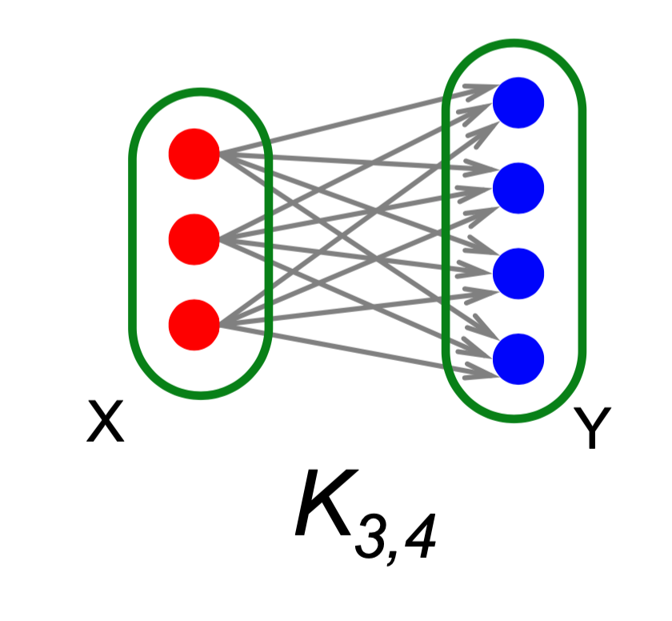
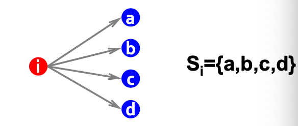
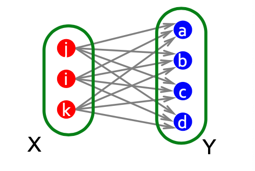

## bipartite graph 

bipartite graph 란

그림과 같이 두개의 계층으로 나눠진 그래프입니다.   
K_{s,t} 로 표기를 하고 s는 왼쪽에 있는 노드의 수, t는 오른쪽에 있는 노드의 수 입니다.  
왼쪽에 있는 노드들은 오른쪽 노드들에 fully connected 입니다. 

전체 그래프에서 이러한 유형의 그래프를 찾는 문제,  
X와 Y에 해당하는 커뮤니티를 찾는 문제는  
여러분야에 적용할 수 있는 문제 유형입니다.  

예시를 통해 Frequent Itemset 문제를 bipartite graph 를 찾는 문제로 구성해보겠습니다.

기존 문제의 가정은 다음과 같습니다.  

- 전체 n개의 아이템 집합 U 가 있습니다.
- U의 부분집합이 m 개 있습니다.(바스켓) $S_1,S_2,\dots,S_m\sube U$
- support 임계값 f 가 있습니다.

이 문제의 목표는  
f 번 이상인 나온 $T \sube S_i$ 을 만족하는 모든 T 를 찾는 것입니다.

이 문제를 bipartite graph를 찾는 문제로 변환해봅시다.

Frequent itemset 을 bipartite graph 으로 간주합니다.  
기존 가정에서 $S_i$ 는 여러개의 item을 갖었습니다.   
이 $S_i$ 는 frequent item과 fully connected 입니다.  
때문에 $S_i$ 를 왼쪽에 item 을 오른쪽에 두면, bipartite graph 구조를 갖게 됩니다. 

여러 $S$ 에서 나타난 공통적인 아이템을 찾는 것이므로  
왼쪽에는 여러개의 $S$ 를 두고, 오른쪽에는 그 $S$ 에 공통되는 아이템들을 갖게됩니다.

이제 $K_{s,t}$  를 바스켓들과 빈도 아이템들로 구성된 하나의  bipartite graph 로 볼 수 있습니다.   
여기서 s는 바스켓 S 의 수(support)이고, t 는 해당하는 빈도 아이템의 수가 됩니다.  
그리고 s가 임계값 f 가 넘는다면 해당 그래프에 Y 가 frequent itemset이 됩니다.

이런식으로 기존 문제들을 그래프에서 작은 커뮤니티를 찾는 문제로 대입하여 풀 수 있습니다.

bipartite graph 관련 세부내용은 추후에 추가할 예정입니다.

