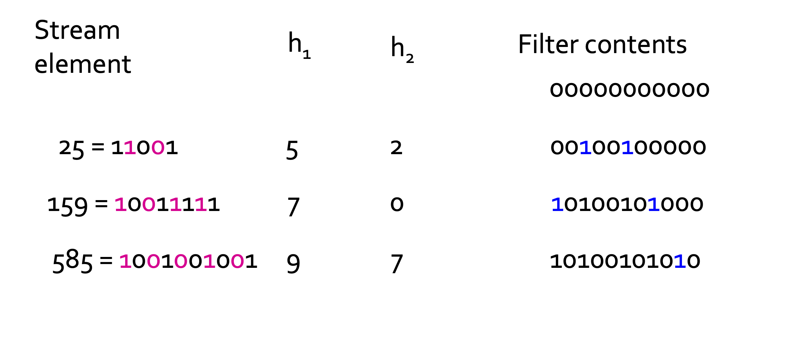

## Bloom Filter

불룸 필터는 다음으로 구성됩니다.

1. 모두 0 으로 초기화된 n개의 bit 의 배열
2. 해시 함수의 모음 $h_1,h_2,\dots, h_k$   
   \+ 각 해시 함수는 'key' 값을 n 개의 버킷으로 맵을 합니다. (bit-array 의 n개의 비트에 따라)
3. 키 값들 m 의 집합 S

블룸필터는 S 안의 key를 갖는 모든 stream element은 통과시키고,  
S 에 포함되지 않은 stream element들은  대부분 차단시킵니다.

### Filter Setting

처음 필터를 설정하기 위해 다음과 같은 작업을 수행합니다.   
bit-array을 초기화 하기 위해 모든 비트를 0으로 둡니다.   
S 안의 키 값을 인자로 받아 k 개의 해시 함수를 각각 사용합니다. (키 값당 k 번의 함수)  
함수의 결과값을 bit-array에 1로 설정해줍니다,  
이에 해당하는 비트들을 1로 둡니다.

#### example

n=11, k=2, m=3 인 상황을 가정해봅시다.  
해시함수 $h_1$ 은 입력비트의 홀수번째 요소들만 골라서 나온 값에 mod 11 을 하고,   
$h_2$ 는 입력비트의 짝수번째 요소들만 골라서 나온 값에 mod 11 을 합니다.

159을 $h_1$에 넣는다면 100111111 이 입력비트,  
홀수번째 요소 비트 0111 이 추출되고, 이는 10진법으로 7입니다.  
7%11 = 7 이므로 filter contents 의 8(7+1)번째 비트에 1을 설정합니다.  
$h_2$ 의 경우 짝수번째 요소 비트 1011 이 추출되고, 이는 11입니다.  
11%11 = 0 이므로 filter contents 의 1번째 비트에 1을 설정합니다.

이와 같이 키값으로 n 비트 크기의 필터를 설정합니다.

### Filtering

입력받은 요소 K 가 S에 포함되는지 테스트하기 위해서,  
$h_1(K),h_2(K),\dots, h_k(K)$ 를 수행하고,  
이것들이 모두 1인지를 체크합니다.   

모두 1로 출력된다면,  
그 스트림 요소는 S에 포함될 가능성이 높아, 통과하게 두고   
하나 이상의 0 이 나온다면,  
K 가 S에 포함되지 않으므로 차단합니다.

## Analysis of Bloom Filtering

S 에 키 값이 있으면, 그 요소는 확실이 블룸 필터를 통과합니다.  
그러나 S 에 없는 키여도 패스될 수 있습니다. (False positive)  
필터의 크기가 가능한 입력크기보다 작어, 해시가 충돌할 가능성이 있기 때문에 false positive의 가능성이 존재합니다.     
이 false positive 의 확률을 어떻게 계산하는지 알고있어야 파라미터를 적절히 조절할 수 있습니다.  

우선 Throwing Darts 모델을 알아봅시다.   
우리가 x개의 타겟과 y개의 다트를 갖고 있고, 다트가 타켓에 맞추는 확률이 모두 동일하다고 가정합니다.   
다트들을 던졌을 때 타겟에 한번도 못맞출 확률을 구해봅시다.  

- 다트가 주어졌을 때, 주어진 타겟을 못맞출 확률은 $1- \frac{1}{x} = \frac{(x-1)}{x}$ 입니다.
- y개의 다트 중 아무것도 히트가 없을 확률은 $(\frac{x-1}{x})^y = (1-\frac{1}{x})^{x(\frac{y}{x})} $ 입니다.
- $(1-\epsilon)^{\frac{1}{\epsilon}} = \frac{1}{e}$ 로 추정하여, 위의 확률은 $e^{-\frac{y}{x}}$ 로 표현할 수 있습니다.

이 모델을 Bloom filter 에 적용해 봅시다.  
n 개의 bit-array 길이, S 안의 m 개의 맴버, k개의 해시 함수 를 갖습니다.  
각 비트를 하나 하나의 타겟으로 볼 수 있고,  
S의 각 맴버를 하나의 다트로 생각할 수 있습니다.  

그러면 주어진 비트가 1이 될 확률은   
하나 이상의 다트가 그 비트에 해당하는 타겟을 맞출 확률입니다.

그래서 타겟의 수는 x=n 이고, 다트의 수는 y=km 입니다.  
여기서 비트 하나가 0 으로 남을 확률은 $e^{-km/n}$ 입니다.  
false positive가 발생하는 것은, 모든 비트가 1이 되는 경우 입니다.  

하나의 비트가 1일 확률은 $1-e^{-km/n}$ 이고  
k 개의 해시함수 모두에서 1이 나올 확률은  
k 번 모두 1로 일치해야 하므로 $(1-e^{-km/n})^k$ 입니다.  
즉, false positive 가 발생할 확률은 $(1-e^{-km/n})^k$ 입니다.

이런식으로 파라미터를 조정하여 false positive 의 확률을 다룰 수 있습니다.