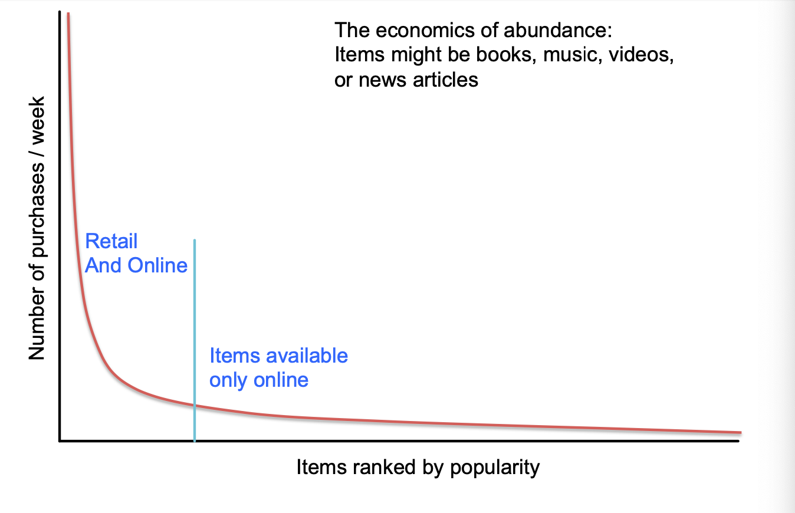
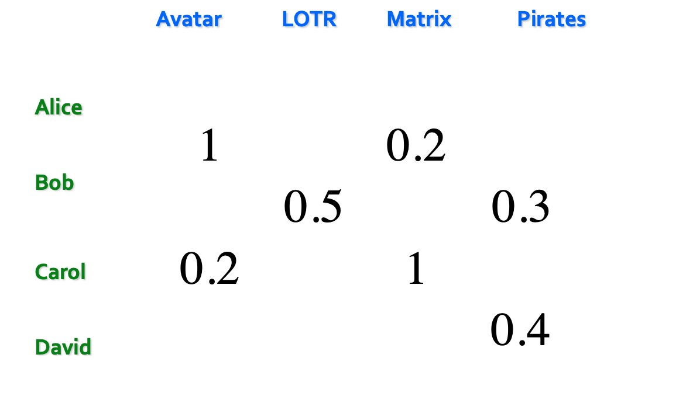

## Recommender Systems

추천시스템(=Recommender System) 이란 사용자가 생각하는 

추천시스템의 발전은 지난 20년에 걸쳐 진행되오고 있습니다.  
과거에는 Shelf space 가 희소했습니다.   
예를들어 마트에서 진열대의 수는 한정적이였고,  
거기에 둘 아이템의 수에도 제약이 있었습니다.  
TV도 채널의 제한 때문에 프로그램을 모두 틀 수 없었습니다.   
과거에는 이러한 상황에 맞춘 추천시스템이 있었고,  
현재 것과는 차이가 있습니다. 

웹의 발전은 이러한 아이템을 제공하는데 필요한 코스트를 줄였습니다.   
그래서 수많은 카탈로그가 있고, 영화, 음악을 제공할 수 있게 되었습니다.   
이렇게 아이템이 많이 제공되면 Long Tail 현상이 발생하게 됩니다.  

그림과 같이 오른쪽으로 긴 꼬리가 생기는 것입니다.  
일반적으로 사람들이 책을 볼 때   
유명한 것 위주로 선택을 합니다.  
인지도가 높을수록 많은 판매가 이뤄지고  
낮은 경우 사람들에게 노출되는 것이 어렵습니다.  

추천은 3가지 종류로 나눌 수 있습니다.

- Editorial and hand curated   
  : 좋아하는 것들의 리스트나 필수품목 같이   
  사람이 직접 만든 추천 리스트입니다.
- Simple aggregates  
  : 조회수, 매출액 등 전체 데이터를 합쳐서 뽑아낸 결과로   
  추천을 합니다.
- Tailored to individual users  
  : 사용자 개인에게 맞추는 추천입니다.  
  넷플릭스나 유투브 등 현재 사용되고 있는 추천입니다. 

Formal Model

일반적인 모델은  
고객의 집합 C와  아이템의 집합 S,   
레이팅의 집합 R 을 사용해 Utility Matrix 를 구성합니다.  
각 사람은 영화에 대한 평가 점수를 줄 수 있습니다.  
4명의 고객과 4개의 영화가 있는 상황은 다음과 같이 표현할 수 있습니다.  

일반적으로 행렬은 드물게(sparse) 나타납니다.

추천시스템에서 다루는 문제는 크게 3가지입니다.

1. 데이터 수집  
   : 위의 유틸리니 행렬에서의 데이터들을 어떻게 모을지가 이슈입니다.
2. 레이팅 추정  
   : 대부분ㅇ