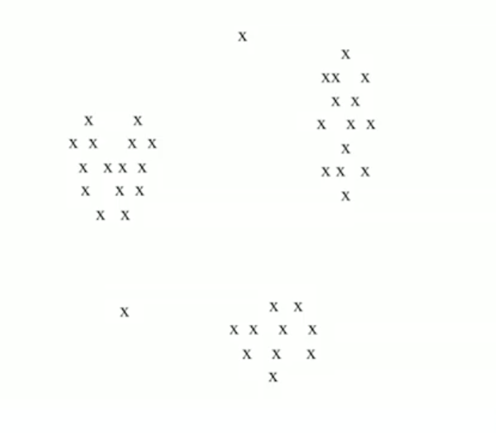
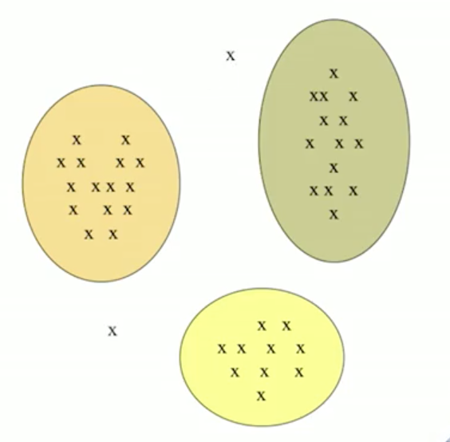

## Clustering

클러스터링은 데이터의 그룹을 찾는 것입니다.  
점 사이의 거리 개념이 있는 점들의 집합이 주어졌을 때  
점들의 그룹을 몇개의 클러스터에 넣는 것입니다.   

같은 클러스터 안의 점(멤버)들은 가까워야하고(혹은 유사)  
다른 클러스터의 점과의 거리는 멀어야 합니다.   

위와 같이 2차원의 데이터(2개의 feature를 가진)가 주어졌을 때  
거리가 가까운 데이터끼리 같은 그룹으로 묶습니다.   
이 예시에서는 유클리드 거리를 사용하여 다음과 같이 묶을 수 있습니다.

3개의 그룹을 다른 색으로 표현하였고,  
각 그룹의 멤버들은 같은 그룹의 멤버과는 가깝고(유클리드),  
다른 그룹의 멤버와는 먼 거리에 있습니다.

이와같이 클러스터링은 '거리' 를 사용해 그룹화 시키는 것입니다.

개념은 단순하지만 실제 작업은 어렵습니다. 

위의 예시는 저차원(2차) 공간이었고, 데이터들이 단순하게 주어져서 쉬웠지만  
고차원의 데이터에서는 처리가 어렵습니다.  
계산을 하는 것도 어렵고 클러스터에 대한 직관적인 이해도 어렵습니다.  

때문에 이번 포스팅에서는 고차원 데이터가 주어진 상황에서  
클러스터링을 수행하는 것을 가정하고 진행합니다.

### Methods of Clustering

클러스터링 기법은 크게 두가지 방식  
Hierachical 과 Point assignment 방식이 있습니다.   

Hierachical 은 bottom up/ top down 으로 나눌 수 있는데  
둘다 가까운 기준으로 클러스터를 합치거나, 나누는 방식입니다.

Point assignment 방식은 특정 수의 클러스터를 지정해   
점과 가장 가까운 클러스터에 포함시키는 방식입니다.

이와 같은 클러스터 기법을 설명하기 앞서  
'거리' 를 어떤식으로 사용할지에 대해 이야기해보겠습니다.

### distance

클러스터에서 사용하는 '거리' 는 상황에 따라 다른 측도를 사용할 수 있습니다.    
유사한 문서를 찾는 상황, 문서를 클러스팅하는 문제 상황을 가정해 봅시다.   
문서를 어떤 관점으로 보느냐에 따라 사용되는 distace matric 에 차이가 있습니다. 

문서를 단어들의 **집합** 으로 본다면 jaccard distance 를 사용합니다.  

문서를 단어들의 공간의 **점**으로 본다면 Euclidean distance 를 사용합니다.  
( $(w_1,w_2,\dots,w_n)$ 에서 $w_i$ 이 문서에서 나오면 $w_i=1$ )

문서를 단어 공간의 **벡터** 으로 본다면 Cosine distance 를 사용하면 됩니다. 

이와 같이 문제의 특성, 관점에 따라 거리 측도에 차이를 줄 수 있습니다.

