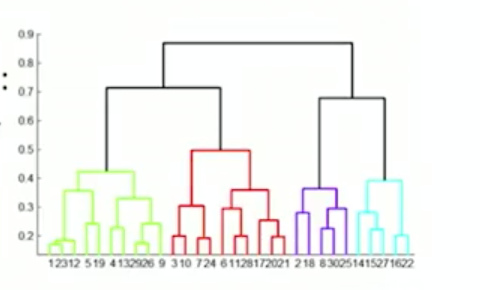
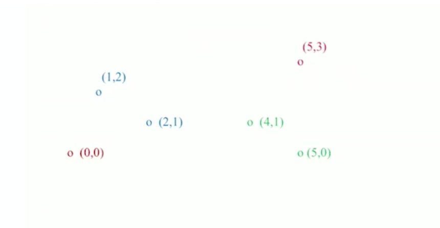
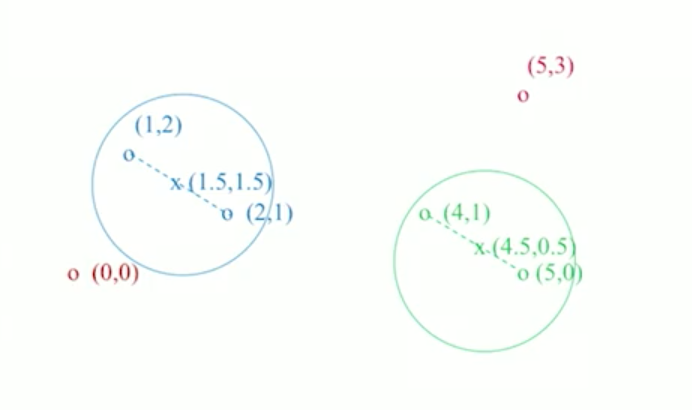
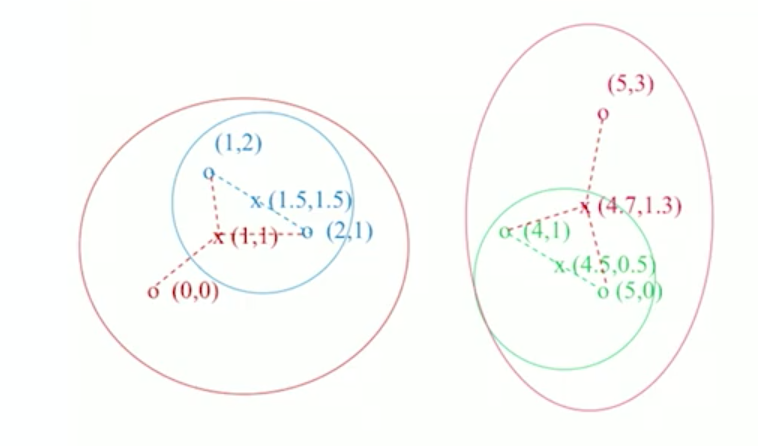

## Hierachical Clustering

계층적 클러스터링은 상향식(Agglomerative, bottom up) 과 하향식 (division, top down) 방식이 있습니다.   
이 두 방식은 순서에만 차이가 있고 작동방식은 동일합니다.  
이 포스팅에서는 상향식 방식으로 설명을 진행하겠습니다.

상향식 클러스터링 방식에서는  
가장 가까운 클러스터끼리 결합을 시키면서 더 큰 클러스터를 만듭니다.

이 방식에서는 다음 3가지를 생각해봐야합니다.  

1. 하나의 점 이상, 클러스터를 어떻게 표현(represent)할지  
2. 클러스터들의 가까움(nearest)을 어떻게 정할지
3. 클러스터 합치는 것을 언제까지 할지

1번에 대해 생각해보자면,  
클러스터 안의 멤버들은 서로 가까운 거리를 갖고 있어야 합니다.  
그래서 클러스터는 centroid 라는 점을 사용합니다.  
**centroid** 는 클러스터의 점들을 평균한 점입니다. 

이렇게 centroid 를 설정하면 클러스터의 가까움은   
각 클러스터의 centroid 와의 거리로 찾을 수 있습니다. 

그림과 같이 6개의 점이 주어졌다고 가정해 봅시다.

여기서 파란색 점 끼리, 초록색 점 끼리 가장 가까우므로   
클러스터를 생성합니다.    
이렇게 생성한 클러스터는 두 점의 평균으로 centroid 를 정할 수 있습니다.

각 클러스터의 centroid 와 다른 점들(빨간색) 과의 거리를 비교하여  
가장 가까운 점을 찾습니다.  
파란색 클러스터의 centroid 는 (0,0) 과  
초록색 클러스터의 centorid 는 (5,3) 과 가깝습니다.

이렇게 클러스터를 다시 결합을합니다.   
여기서 유의할 점은 centroid 는 포함된 점들의 평균이지,  
centroid 와 새로운 점의 평균이 아닙니다. 

이런식으로 유클리드 공간에서의 클러스터링을 수행할 수 있습니다. 

그러나 공간이 유클리드가 아닌 경우가 있습니다.   
이 공간에서는 점들의 '평균' 개념을 사용할 수 없습니다.  
그래서 centroid 대신 clustroid 를 사용합니다.

**clustroid** 는 클러스터 내에서 다른 점들과 closet한 점을 말합니다.  
여기서 **closet** 의 개념은 다음과 같이 다양하게 구현될 수 있습니다. 

- 다른 점들과의 최대 거리가 가장 작은 것
- 다른 점들과 평균 거리가 가장 작은 것
- 다른 점들과 거리 제곱 합이 가장 작은 것

이런식으로 closet 을 설정하여  
가까운 클러스터끼리 결합시키면서  
상향식 클러스터링을 수행할 수 있습니다.

상향식 클러스터링에서 3번째 이슈,  
언제까지 클러스터링을 할 것인지에 대해 생각해 봅시다. 

두가지 방식이 있습니다.  

우선, 클러스터의 수 k 를 지정하여, 결합한 클러스터 수가 k 가 되었을 때 멈추는 방식이 있습니다.  
사전에 데이터가 어느정도로 나눠질지 알 때 사용하기 적합합니다.

두번째 방식은,   
cohesion 을 설정하여, 이 cohension 이 떨어질 때 멈추는 것입니다.(다음 cohension 이 줄어들 때)

여기서 cohesion 은 다음과 같이 여러 기준으로 설정 될 수 있습니다.   
Diameter : 같은 클러스터안의 점 사이 최대 거리  
Radius : centroid 나 clustroid 로부터 해당 클러스터 안의 점과의 최대 거리  
Density : 단위 크기 당 포인트의 수, 클러스터의 점의 수를 diameter나 radius 로 나눈 것   

이와 같은 과정을 통해 계층적 클러스터링을 수행할 수 있습니다.

### Implementation

클러스터링은 많은 연산을 요구합니다.  
각 점은 다른 점들과의 거리를 계산해야하고,($N^2$)  
가까운 점들과 클러스터를 구성한 후($N$) 다시 거리를 계산해야합니다.  
그래서 cube, $O(N^3)$ 의 연산이 필요합니다.  
priority queue 를 사용해 구현하더라도 $O(N^2 \log N)$  의 계산이 필요합니다. 

대부분의 작업은 N 자체도 크기 때문에  
연산시간이 오래걸릴 뿐 아니라 메모리에 올리는 것도 어렵습니다.  

그래서 클러스터링에 대한 다른 접근 방식이 필요합니다. 

