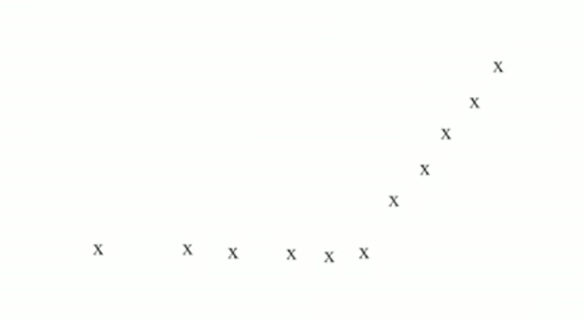
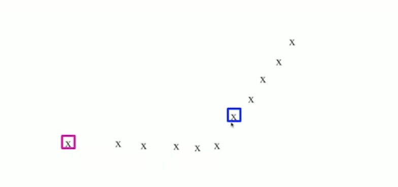
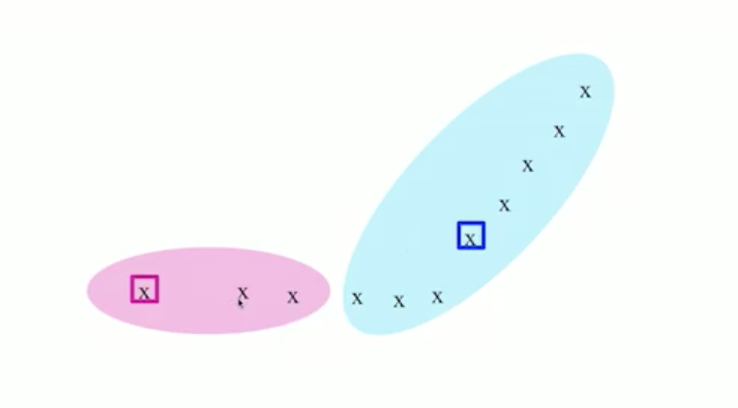
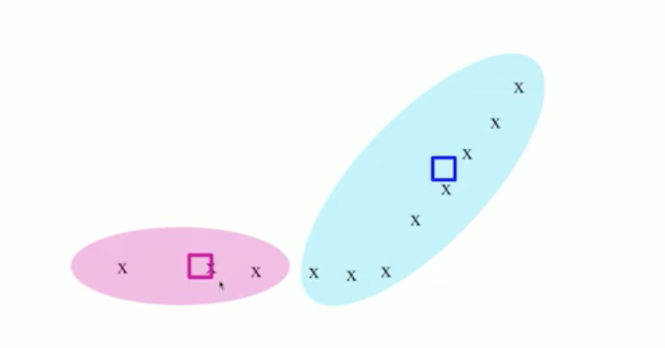
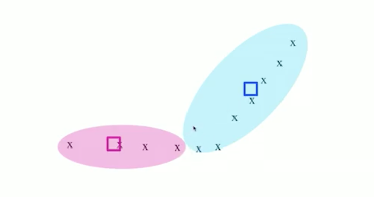
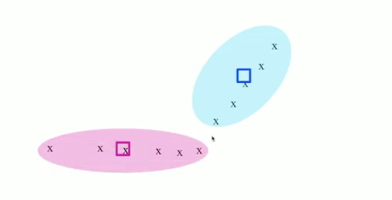
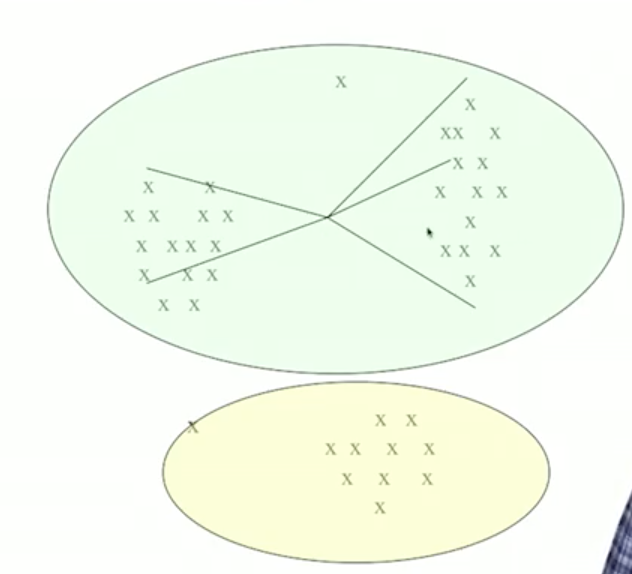
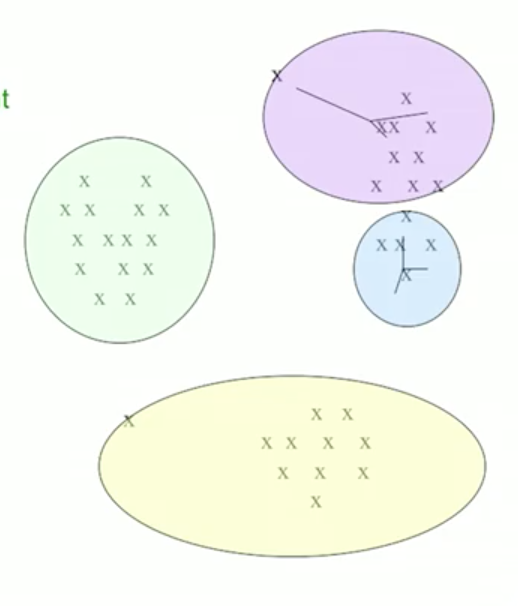
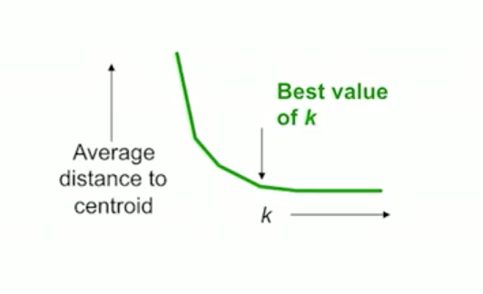

## K-means Algorithm

계층적 클러스터링의 경우 $O(N^3)$ 의 계산량을 필요로하므로  
실제 상황에서 사용하기 어렵습니다.  
이와달리 k-mean 방식은 O(kN) 정도의 계산량으로 클러스터링을 할 수 있는 방식입니다.

이 알고리즘은 유클리안 공간에서 동작하고,  
클러스터를 찾는 과정은 다음과 같습니다.    

1. 클러스터의 수 k 만큼의 점을 선택합니다.(무작위나 샘플링해서 선택)  
2.  각 점들을, 선택된 k개의 클러스터의 centroid 중 가장 가까운 클러스터에 할당합니다.
3. 모든 점이 클러스터에 할당되면, 각 클러스터의 centroid 를 갱신합니다. (새로 할당된 점들과 같이)
4. 클러스터의 centroid 를 기준으로 각 점에서 가까운 클러스터로 다시 할당 합니다.
5. 각 점에서 클러스터가 변하지 않을 때까지, 수렴할 때까지   
   3번과 4번 을 반복합니다.

예시를 통해 확인해 보겠습니다.

위와 같이 2차원 공간에 데이터들이 주어졌다고 가정해 봅시다.   
여기서 k=2 로 두고,  
무작위로 두개의 점을 선택합니다.  

그리고 각 점들에 대해, 선택한 점들과  가까운 점들로  
클러스터를 설정합니다.

만들어진 클러스터에서 새로운 centroid 를 계산합니다. 

그 centorid 와 가까운 점들로 다시 클러스터링을 합니다.

클러스터 데이터가 바뀌었으므로  
다시 centroid 를 계산하고  
그 centroid 로 점들에게 클러스터를 할당합니다.

새로운 클러스터로 centroid 계산하고  
다시 점들에게 할당을 합니다.  
위와 같은 경우에는 클러스터가 유지되어서  
클러스터링이 완료됩니다.

이제 k를 몇으로 설정해야 하는지에 대해 생각해봅시다.  
다음과 같은 상황은 k 를 적게 설정하거나 크게 설정하여 발생합니다.   
  

k 가 작으면 centroid 와 점들 간 거리가 평균적으로 멀어집니다.  
그림과 같이 k는 늘어나면서 centroid 와 거리가 빠르게 떨어지다가   
특정 시점 이후에는 천천히 떨어지게 됩니다.    

그래서 적절하게 k 설정하는 것이 중요합니다. (k 가 많으면 계산량이 늘어납니다.)

이제 k개의 포인트를 어떤 값으로 초기화 할지에 대해 생각해봅시다. 

k-mean 에서는 초기 k 의 점에 따라 계산량의 차이가 있고  
최종결과도 다르게 나옵니다. (local optimal $\neq$ global optimal)  
클러스터에 예상되는 적절한 위치로 초기화 되었다면   
계산량이 적을 것이고  
그렇지 않다면 수렴될때까지 많은 계산을 수행해야 할 수 도 있습니다.

초기값이 전체 계산에 큰 영향을 미치므로 신중히 선택해야합니다. 

점의 초기값을 설정하는 방식은 두가지가 있습니다.

첫번째는 Sampling 입니다.  
전체 데이터 중 일부를 샘플링 하여 계층적 클러스터링을 합니다.   
이 작업으로 얻은 k 개의 클러스터에서 점을 하나씩 선택합니다.(centroid 와 가까운점)  

두번째는 dispersed 한 점의 집합을 찾는 것입니다.  
처음 점 하나는 랜덤으로 선택을 하고  
두번째 점은 그 점에서 가능한 멀리 떨어진 점을 선택합니다.  
세번째 점은 다른 점들과의 최소거리가 최대한 크도록 선택합니다.  
이와 같이 반복하여 k 개의 점을 선택합니다. 

