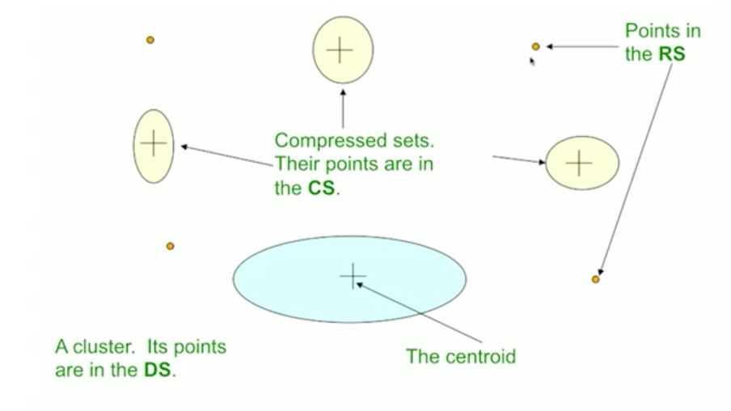

k-mean 알고리즘은 k 개의 클러스터에 해당하는 데이터들이 수렴할 때 까지 반복을 하였습니다.  
각 라운드 마다의 계산복잡도는 O(kN) 이지만,  
수렴할 때 까지 kN 의 연산을 반복해야합니다.  

k 를 어떤 점으로 초기화 하느냐에 따라서  
수렴까지의 라운드 횟수에 차이가 생기고,   
이 차이는 상황에 따라 다르므로 예측할 수 없습니다.

N 이 메모리에 올리기 어려울 정도로 크거나,  
수렴할 때까지 반복해야한다는 문제 상황을 보완할 수 있는 것이  
BFR(Bradley-Fayyad-Reina) 알고리즘입니다.

## BFR

BFR 알고리즘은 큰 데이터(메모리에 들어가지 않는)를 k-mean 방식으로 클러스터링하기 위한 알고리즘입니다.

이 알고리즘은 유클리드 공간에 있고,  
각 클러스터의 centroid 를 중심으로 정규 분포가 형성된다는 가정하에 수행됩니다.

각 차원은 독립적이고,  모든 점은 각 차원 마다의 클러스터의  
centroid 의 정규분포를 따른다고 가정을 하는 것입니다.  
(클러스터의 각 차원에 따라 평균과 표준편차가 다릅니다.  )

그래서 점이 주어졌을 때 어떤 클러스터에 속하는지의 likelihood 를 구할 수 있급니다. 

BFR 은 데이터를 메모리에 다 올릴 수 없는 상황을 가정합니다.  
때문에 디스크에 있는 청크를 하나씩 메모리에 가져와서 처리를 합니다.

청크를 하나씩 처리하면서  
모든 클러스터에 대한 메타 데이터를 유지합니다.   
즉, 청크를 하나씩 가져와서 클러스터에 대한 통계량을 저장하는 것입니다.   

청크를 요약(통계량) 하기 때문에  
전체 데이터에 대해 한번의 패스만으로도  처리하는 것이 가능합니다.  
데이터에 대해 한번의 패스가 끝나면 클러스터가 완료됩니다.

알고리즘을 살피기 앞서서   
사용할 데이터에 대해 먼저 살펴봅시다.

클러스터에서 사용되는 점들은  
다음과 같이 3가지 종류로 분류될 수 있습니다.

- Discard set  
  : 이 점은 centroid 와 가까운 점입니다.  
  해당 클러스터의 통계량을 업데이트하고 버려집니다.
- Compression set  
  : 기존의 centroid 와는 가깝지 않고, 그 그룹안의 점들과 가까운 점들입니다.  
  점들의 정보는 저장되지만 클러스터가 할당되지는 않습니다. (또다른 작은 클러스터)
-  Retaind set  
  : DS와 CS 에 속하지 않은 점들입니다. 다른 집합들과 멀리 있고, 주변에 다른 점도 없는 점입니다.  
  이 집합에 해당하는 점은 계속 추적해야 하므로 메모리에 유지합니다.

위 집합을 그림으로 보자면 다음과 같습니다.  

클러스터에 있는 점(DS) 는 통계량으로 요약되므로 저장하지 않고,  
점들의 그룹으로 있는 점(CS) 또한 클러스터는 아니지만 그룹의 통계량으로 요약되어 저장하지 않습니다.  
RS에 해당하는 점들만 메모리에 저장하고 있습니다.

우선 Discard set 에 해당하는 점을 요약하는 방법에 대해 알아보겠습니다.

DS 에 해당하는 클러스터의 점의 수를 N 이라고 합니다.  
SUM 이라는 벡터는 해당 점들의 합입니다.   
각 차원의 성분은 그 클러스터에 해당하는 점들의 그 차원에서의 합입니다.  
SUMSQ 는 각 성분에서 클러스터에 해당하는 점의 제곱합입니다.    
여기서 클러스터의 평균, centorid 는 SUM/N 으로 계산되고  
클러스터의 분산은 (SUMSQ/N) - (SUM/N)^2 으로 계산됩니다.

알고리즘은 다음과 같습니다.

1. 청크로 부터 클러스터의 centroid 와 충분히 가까운 점들을 찾습니다.  
2. 그 점들을 DS와 그 클러스터에 더합니다.
3. 각 클러스터의 통계량에 N과 SUM, SUMSQ 를 더합니다.
4. 나머지 점들(클러스터와 가깝지 않은 것들) 과  메모리에 있던 RS 를 아무 클러스터링 일고리즘을 써서 클러스터를 만듭니다.   
   만들어진 클러스터는 RS 로 두고, 아닌 점들은 RS 로 둡니다.
5. CS 에 해당하는 여러 집합들 중 합칠 수 있는 것을 합칩니다.
6. 마지막 라운드인 경우, 모든 CS의 집합들과 RS의 점들을 근처 클러스터에 합칩니다.

이 과정에서 2가지 이슈가 있습니다.  

1. 어떤 기준으로 '클러스터와 가깝다' 라고 볼 것인가(1번)
2. 어떤 기준으로 CS의 두개의 집합을 합칠 것인가(5번)

1번에서는 Mahanlanobis distance 를 사용합니다.  
이는 점이 centroid 에 가까울 likelihood 를 사용하는 것입니다.

특정 차원 i 에서 거리 y 는  $y_i = \frac{x_i - c_i}{\sigma_i}$ 이고    
전체 Mahanlanobis distance 는 각 차원의 거리를 제곱해서 더한다음 루트를 씌워서 구합니다.  

$\sqrt{\Sigma_{i=1}^d y_i^2}$ 

이 MD 는 편차와 같은 맥락으로 해석할 수 있습니다.  
만약에 모든 $y_i$ 가 1인 경우($\sigma$) MD 는 $\sqrt{d}$ 가 나오고  
통계 특성을 활용하여  
 $y \leq \sqrt{d}$  이면 68%,  
 $y \leq 2\sqrt{d}$ 이면 95%  
 $y \leq 3\sqrt{d}$ 이면 98% 의 확률을 구할 수 있습니다.

 이런식으로 MD 을 구하여,   
임계값으로 '가깝다' 의 기준을 정할 수 있습니다.

2번째, CS 의 집합끼리 결합하는 것은 여러 접근방법을 사용할 수 있습니다.  
각 집합은 N, SUM, SUMSQ 를 갖고 있기 때문에  
이를 통해 합치고 나서의 분산을 구하여  
그 값에 따라 처리하는 것이 일반적입니다.

여기에 덧붙여 차원마다 weight 를 주는 등의  
문제 상황에 따라 조정하여 처리합니다.

