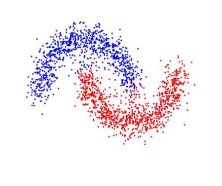
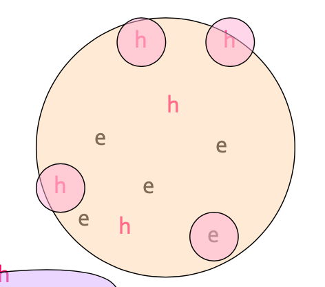
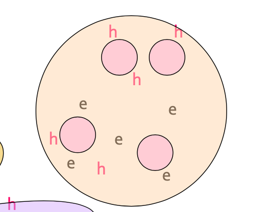

## CURE

BFR 알고리즘은 각 차원에서 클러스터 마다 분포를 형성해야한다는 가정에서 동작할 수 있습니다.

그러나 실제 상황에서 데이터들은 그림과 같이

정규 분포를 따르지 않는 상황이 발생할 수 있습니다.

이러한 상황에서 클러스터링을 수행할 수 있는 알고리즘이  
CURE(Clustering Using REpresentatives) 입니다.

이 알고리즘 또한 유클리드 공간이라는 가정하에 수행됩니다.

CURE는 어떠한 형태의 클러스터도 형성할 수 있지만  
BFR 과 달리 데이터에 대해 2번의 패스가 필요합니다.

알고리즘은 다음과 같습니다.

1. 메모리에 올릴 수 있는 샘플 데이터들을 선택합니다. 
2. 샘플 데이터를 가지고 (계층적) 클러스터링을 사용해 클러스터를 생성합니다.
3. 대표(representative) 점들을 선택합니다.   
   클러스터의 각 대표 점들은 최대한 disperse 하도록 선택합니다.
4. 각 대표점들을 클러스터의 centroid 와 일정 비율 만큼 가깝게 이동시킵니다.(e.g. 20%) 
5. 전체 데이터를 스캔합니다.(2번째 패스)  
   각 점에서 가장 가까운 대표점들이 해당하는 클러스터에 넣습니다.

그림으로 보자면 

이렇게 클러스터에 있는 점들을(4) 선택하고

가운데로 조금 이동시킵니다.

그리고 다음 패스에서, 이 점과 가까우면 해당 클러스터로 넣습니다.

이런 방식으로 수행하면  
대표점에 가까운 점들은 정규분포와는 멀더라도 클러스터에 편입될 수 있습니다.   
그리고 centroid 에 어느 정도 가깝게 이동시켰기 때문에  
클러스터의 응집도 보장할 수 있습니다.

