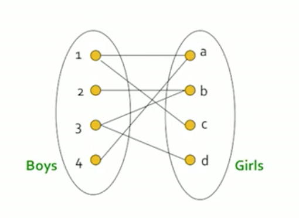
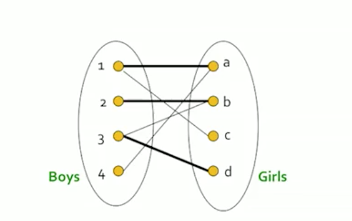
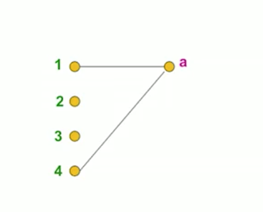
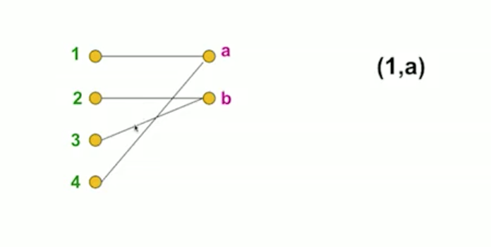
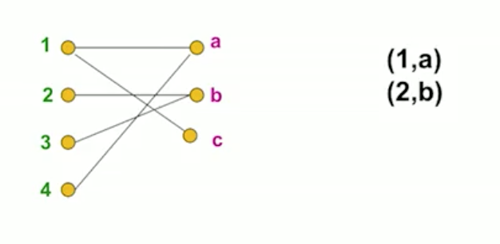
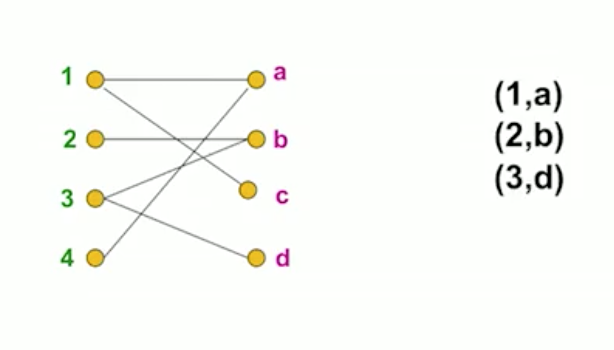
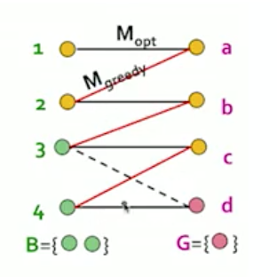

## Online Algorithm

기존 알고리즘은 전체 입력 데이터를 볼 수 있고 이를 계산하는 알고리즘이었습니다. 

이에 반해 온라인 알고리즘은 데이터를 시간에 따라 부분적으로 볼 수 있고, 다시 볼 수 없어서, 그 시간에 따라 특정 결정을 내려야하는 상황에서 사용하는 알고리즘입니다.  
이는 스트림 모델과 유사하지만 차이가 있습니다.

Bipartitie matching 예시를 통해 설명해보겠습니다.

Bipartitie matching 이란 두개의 노드 집합과 이를 잇는 엣지가 있고  
다른 집합의 노드와 일대일로 매칭해주는 문제입니다.

다음과 같이 집합에 따른 노드와 엣지가 주어졌을 때  

이런식으로 연결을 해주는 것입니다.  
1,2,3 에 해당하는 boy 들은 각 a,b,d 에 해당하는 girl 과 매칭이 되었고,  
4와 c 는 매칭이 되지 않았습니다.  
매칭 쌍 집합 M 은 M = {(1,a), (2,b), (3,d)} 이고  
이 집합의 카디널리티(cardinality) 는 $|M| = 3$ 입니다.

여기서 4개의 쌍이 모두 있는 경우를 perfect matching 이라고 합시다.  
그리고 maximum matching 은  현 문제 상황에서 최대한으로 만들 수 있는 매칭으로 정의합니다.  
perfect matching 은 maximum과 같을 수도 있지만 상황에 따라 maximum이 더 작을 수 있습니다.

Matching Algorithm 이란  
위와 같이 bipartite graph 가 주어졌을 때, maximum matching 을 찾는 알고리즘입니다.  
offline 상황인 경우 단순하게 구할 수 있지만,  
이번에는 online 상황일 때 푸는 알고리즘을 살펴봅니다.

문제상황은 다음과 같습니다.

남자와 여자의 집합이 주어지고,   
각 라운드마다 여자 한명의 엣지를 확인할 수 있습니다.  
그리고 그 때 남자는 그 여자와 매칭을 할지, 안할지 선택할 수 있습니다.

이런 문제는 서버에서 작업을 할당하는 상황에서 적용할 수 있습니다.

예를들어

첫 라운드에서 a 의 엣지 (1, a), (4, a) 를 확인할 수 있습니다.

여기서 (1, a) 를 선택했다고 보고,

두번째 라운드에서 엣지 (2, b), (3, b) 를 확인합니다.   
첫번째 엣지 (2, b) 를 선택했다고 치고

다음 라운드에 엣지 (1, c) 를 확인합니다.  
여기서 1의 경우 첫번째 라운드에서 선택했기 때문에   
이번 라운드에서 매칭을 할 수 없습니다.

마지막 라운드에서 (3, d) 엣지를 확인하고 매칭하여 전체 매칭이 종료됩니다.

전체의 엣지를 알고 있었다면 최적의 매칭을 할 수 있었습니다.  
위의 상황에서 (1, c) 쌍의 매칭이 안되었는데,  
(1, c) 가 있다는 것을 알고 있었다면  
첫번째 라운드에서 (1, a) 가 아니라 (1, d) 를 선택했을 것입니다.

이와 같이 online 상황에는 그 시점의 정보가 부족하기 때문에  
최적의 매칭을 구하는것이 어렵고, 모든 상황에서 최적을 구하는 것은  
사실상 불가능합니다.

그래서 heuristics 을 사용합니다.  
여기서는 greedy 방식으로 접근을 합니다.  
단순하게, 가능한 쌍이 있다면 매칭을 하고 없으면 하지 않는 방식입니다.

이 알고리즘을 사용할 때  
이것이 어느정도의 성능이 나오는지 분석을 해봅시다.

이를 위해 Competitive ratio 를 사용하는데 다음과 같습니다. 

Competitive ratio $$=  \min_{all\ possible \ input \ I}(\frac{|M_{greedy}|}{|M_{opt}|} )$$   
그리디의 카디널리티와 최적 상황의 카디널리티의 비율이 최소가 되는 것을 사용하므로  
그리디의 카디널이티가 가장 작은, worst 상황에서의 성능을 의미합니다.

위 상황을 생각해봅시다. 

직선의 검은선은 최적의 알고리즘에서의 매칭이고  
사선의 빨간선은 그리디 알고리즘을 사용한 매칭입니다. 

그리디 알고리즘을 사용한 경우, 마지막의 d 가 매칭이 되지 않았습니다.  
d 를 집합 G 에 넣고, d 와 인접한 노드 3,4 를 집합 B에 두었다고 합시다.  
즉, 집합 G 는 $M_{opt}$ 에는 있지만 $M_{greedy}$ 인 여성의 집합입니다.  

여기서 다음을 유도할 수 있습니다.  

(1) $|M_{opt}| \leq |M_{greedy}| + |G|$ 

모든 B와 인접한 여자들은 $M_{greedy}$ 에서 매칭이 된 상태이므로 

(2) $|M_{greedy}| \geq |B| $

를 알 수 있습니다.  
또한 B 에 있는 노드들은 G 에 인접하고 매칭이 가능한 것들이기 때문에

(3)$|G|\leq |B|$ 

가 성립합니다.  
(1) 에 |G| 에 (3)을 대입하고 |B| 에 (2)를 대입하면 다음 식을 얻습니다. 

$|M_{opt}| \leq |M_{greedy}| + |M_{greedy}|$

$|M_{opt}| \leq 2|M_{greedy}| $

$\frac{|M_{greedy}|}{|M_{opt}|} \geq \frac{1}{2}  $

이렇게 Competitive ratio 이 1/2 이상이 나오는 것을 확인할 수 있습니다.  
즉, greedy 알고리즘을 사용하였을 때 최악의 경우여도(lower bound)  
1/2 이상의 성능을 보일 수 있다는 것을 의미합니다. 

