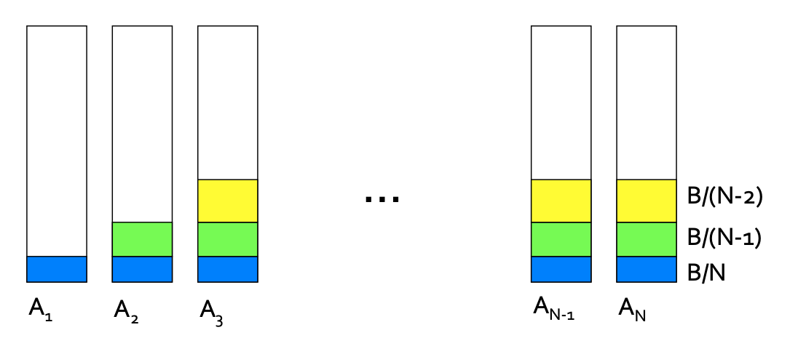
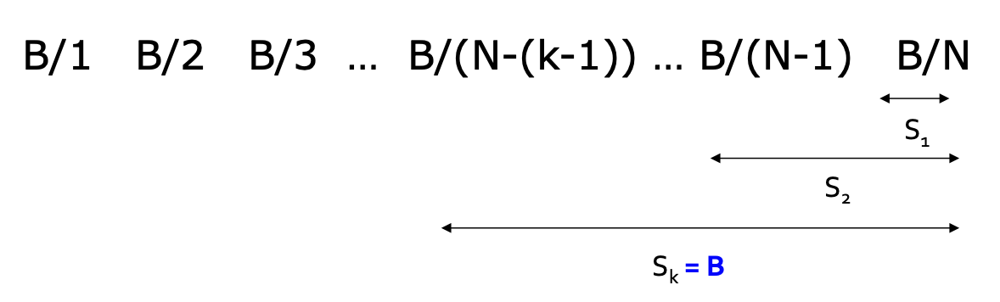
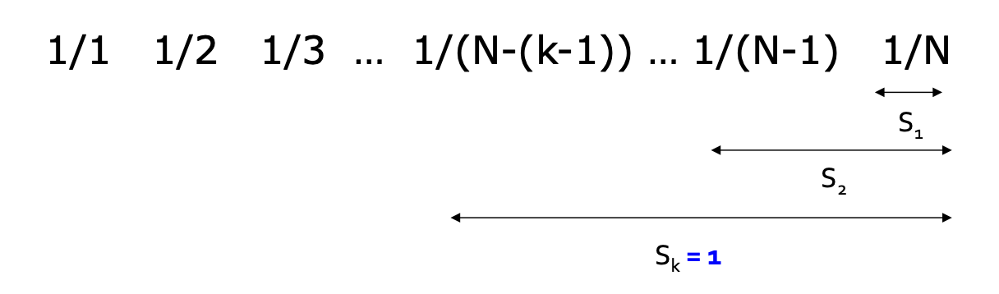
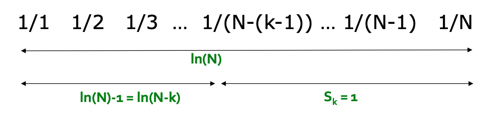

## Balance Algorithm

이전 포스팅에서는 advertiser 가 2명이 상황에서  
Balance 알고리즘의 competitive rate 가  $\geq 0.75$  인 것을 증명하였습니다.  

이번 포스팅에서는 더 일반적인 상황에서 competitive rate 가  
어떻게 나오는지 유도를 해봅니다.  

다음과 같이 일반적인 상황을 가정해봅시다.

- N 명의 advertiser 가 있다. 
- 예산 N 명 모두 B이고, B>N 이다.
- N 라운드마다 B개의 쿼리로, NxB 개의 쿼리가 있습니다.
- 입찰은 라운드에 따라 다음과 같이 advertiser에게 진행됩니다. 
  - R1 : $A_1,A_2,\dots,A_n$
  - R2 : $A_2,A3,\dots,A_n$
  - Ri : $A_i,A_{i+1},\dots,A_n$

위 문제에서 최적의 경우  
i 라운드의 쿼리가 $A_i$ 로 할당되는 것이고  
이 때의 수입은 $N\cdot B$ 입니다.

Balance 알고리즘을 사용하면 다음과 같은 결과를 얻습니다.

R1 라운드에서는 $A_1,\dots ,A_n$ 모두에게 하나씩 쿼리가 할당되어 총 $\frac{B}{N}$ 의 수익을 얻습니다.  
R2 라운드에서는 $A_1$을 제외한 $A_2,\dots ,A_n$ 에게 하나씩 할당되어 총 $\frac{B}{N-1}$ 의 수익을 얻습니다.   

Advertiser k 의 광고 할당 비용을 계산하면 다음과 같습니다.

$S_k = \sum_{1\leq i\leq k} \frac{B}{N+1-i}$ 

그러나 Advertiser 의 예산은 B 로 한정되어 있기 때문에  
$S_k = B$ 일 때 까지만 광고를 할 수 있습니다.

다음과 같이 $S_k$ 가 B가 될 때까지 진행이됩니다.  
지금 작업의 목표는 k를 찾는 것입니다. B 는 필요없으므로 나눠서 간소화할 수 있습니다.  

N이 충분히 클 때, 오일러의 공식을 사용하여 다음과 같은 결과를 얻을 수 있습니다.   

1부터 1/N 까지의 합은 ln(N) 이고,  
$S_k=1$ 이고, ln(N) -1 이 ln(N-k) 에 해당합니다.  

$\ln(N)-1 = \ln(N-k)$ 에서 $\ln(\frac{N}{N-k}) = 1$ 을 유도하고,  
$\frac{N}{N-k} = e$,  $k = N(1 - \frac{1}{e})$ 를 얻습니다.

즉, $N(1 - \frac{1}{e})$ 라운드까지 쿼리를 할당할 수 있게되고,  
이 상황에서 수익은 $B\cdot N(1 - \frac{1}{e})$ 이 되어 

Competitive ratio 은 $1 - \frac{1}{e}$ 임이 증명됩니다.

위 결과는, 모든 예산이 B로 동일하다는 가정하에 있었습니다.  
그러나 예산이 Advertiser 마다 다른 경우에도 동일한 copetitive ratio 를 얻습니다. 

q 쿼리와 Advertiser i 가 있다고 가정해봅시다.  
여기서 예산은 $b_i
$ 이고, 쿼리는 $x_i$ 개의 bid(입찰기회) 를 갖고, 사용한 금액은 $m_i$ 로 둡니다.  

그러면 남은 예산의 비율은 $f_i = 1-m_i/b_i$ 로 표현할 수 있고,   
위와 같은 방식에서 $S_k$ = 1 대신 $f_i$ 을 사용,  
 $\psi_i(q) = x_i(1-e^{-f_i})$ 를 정의하고, 이는 미사용 잔액을 의미합니다..  

q 는 잔액이 가장 큰, $\psi_i(q)$ 이 가장 큰 Advertiser에게 할당을 합니다.  
$f_i = 1$ 가 일 때 $1-\frac{1}{e}$ 가 되고  
따라서 이 일반적인 상황에서 Competitive ratio 도 $1-\frac{1}{e}$ 가 됩니다.

