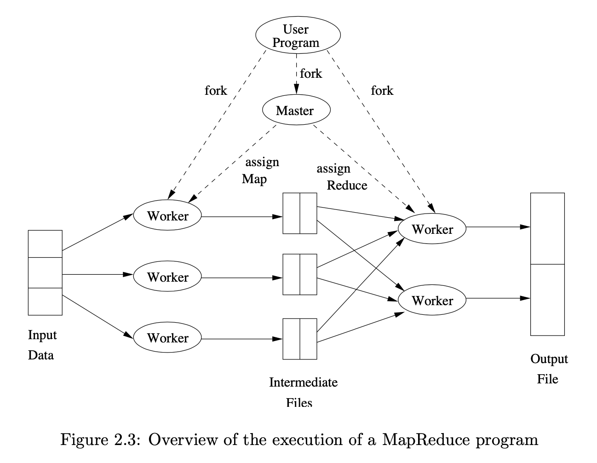

# 2. MapReduce and the New Software Stack

소위 'Big-data' 분석이라 불리는 최근 데이터 마이닝 어플리케이션은 많은 양의 데이터를 빠르게 관리하도록 요구합니다. 이러한 어플리케이션 중 대다수에 있는 데이터들은 규칙적이고 병렬로 처리할 수 있습니다. 

예를들어

중요도에 따른 웹페이지 랭킹은 수십억 차원의 matrix-vector 곱의 반복과 관련이 있습니다. 이러한 어플리케이션을 PageRank 라고 합니다. 

SNS 에서 친구를 찾는 것은 수백만 노드를 가진 그래프와 관련이 있습니다. 

이러한 것들을 다루기 위한 새로운 소프트웨어 stack 이 연구되고 있습니다. 

이러한 프로그래밍 시스템은 computing clusters 에서 병렬적으로 설계됩니다. Computing clusters 는 기존 프로세서(compute node) 를 switch 나 이더넷 케이블로 연결하여 구성합니다. 

소프트웨어 스택은 새로운 형태의 파일 시스템, 'distributed file system'(DFS) 부터 시작합니다. 이는 기존 운영체제에서의 디스크 블록들 보다 더 큰 단위로 기능합니다. DFS 는 여분의 데이터를 복사하여 데이터가 수천개의 노드로 분배 되었을 때 발생하는 'media failures' 를 예방합니다.

이러한 파일시스템에서는 고수준의 프로그래밍 시스템이 개발되었습니다. MapReduce 프로그래밍 시스템은 이 새로운 소프트웨어 스택의 중심에 있습니다.  MapReduce 의 구현은 대규모 데이터에서의 일반적인 연산의 대부분을 가능하게 하고 이를 computing clusters 에서 수행할 수 있도록 하여 효율적으로 만듭니다. 

맵리듀스 시스템은 빠르게 발전하고 확장되고 있습니다. 오늘날 맵리듀스 프로그램이 더 높은 레벨의 프로그래밍 시스템(SQL과 같은)에서 만들어지는 것이 일반적입니다. 맵리듀스는 유용하면서 간단하고 범용이며 강력한 개념입니다. 여기서는 맵리듀스에 대해 다룹니다. 우선 비동기적인 workflow를 지원하는 시스템에 대해 다루고 재귀 알고리즘으로 구현하는 시스템을 다룹니다.

## 2.1 Distributed File Systems

대부분의 계산은 하나의 프로세서에서 수행됩니다. 이 계산은 메인 메모리와 캐시, 디스크(compute node) 를 갖고 수행됩니다. 이전에는 과학적인 계산과 같이 병렬 처리를 필요로하는 어플리케이션은 특수한 목적의 병렬 컴퓨터에서 수행하였습니다. 이는 많은 프로세서와 특수한 하드웨어로 구성됩니다. 그러나 대규모 웹서비스의 보급으로 수천의 컴퓨트 노드가 독립적으로 운영되는 시설에서 더 많은 계산이 수행되게 되었습니다. 이러한 시설에서 컴퓨트 노드는 상용 하드웨어는 특수목적의 병렬 컴퓨터와 비교하여 가격이 저렴해졌습니다.

이러한 새로운 컴퓨팅 설비는 프로그래밍 시스템의 새로운 시대를 열었습니다. 이 시스템은 병렬화 파워와 동시에 수천의 요소들이 결합한 하드웨어에서 발생할 수 있는 문제들을 해결할 수 있습니다. (fail) 이 세션에서는 이 컴퓨팅 설비의 특징과 이 설비의 이점을 높이는 특수한 파일 시스템의 특징에 대해서 언급합니다. 

### 2.1.1 Physical Organization of Compute Nodes

새로운 병렬 컴퓨팅 구조(cluster computing) 은 다음과 같이 구성됩니다. 컴퓨트 노드는 렉(=racks) 에 보관됩니다. 8에서 64개의 노드가 하나의 렉에 보관됩니다. 하나의 렉에 있는 노드들은 하나의 네트워크로 연결됩니다. 일반적으로 연결은 GB의 이더넷(=Ethernet)으로 연결됩니다. 여러개의 노드가 연결된 렉은, 여러개가 있을 수 있고, 그 여러개의 랙들은 다른 레벨의 네트워크나 스위치로 연결됩니다. 렉 간(inter-rack) 대역폭(=bandwidth)은 렉 내부의 이더넷의(intrarack) 대역폭 보다 더 높습니다. 그러나 렉 간의 통신이 필요한 노드들의 쌍의 수가 주어진다면 이 렉 간 대역폭은 더 높아야 합니다. 

그림2.1 은 시스템의 구조를 보여줍니다.

시스템의 컴퓨트 노드나 통신 링크와 같은 컴포넌트들은 더 많아질수록 시스템의 정상작동이 어려워질 수 있습니다. 일반적인 failure 는 단일 노드(해당 노드의 디스크 충돌) 의 손실이나 렉 전체(네트워크 장애)의 손실에서 발생합니다.

일부 중요한 계산은 수천개의 노드에서 몇분에서 몇 시간까지 걸릴 수 있습니다. 만약 하나의 컴포넌트가 실패할 때마다 계산을 중단하고 재시작해야한다면, 그 계산은 영영 못끝낼 수 있습니다. 이러한 문제를 해결하기 위해 2가지 방식이 제시됩니다. 

1. 파일의 여분이 저장되어야 합니다. 파일을 복사하지 않는 경우, 하나의 노드가 실패할 때 그 노드의 파일들은 그 노드가 대체될 때 까지 사용할 수 없습니다. 또, 백업이 안되있는 경우, 디스크 충돌이 발생했을 때, 그 파일은 아예 못쓸수 있습니다. 
2. 계산은 task 로 나눠져야 합니다. 테스크가 실패한다면 그것은 다른 테스트에 영향없이 그 테스크만 재시작하도록 해야합니다. 이 전략은 맵리듀스 프로그래밍 시스템을 따릅니다. 

실제 사용되는 DFS

- Google File System(GFS)
- Hadoop Distributed File System(HDFS)
- Colossus@@

### 2.1.2 Large-Scale File-System Organization

클러스터 컴퓨팅을 사용하기 위해서는, 파일은 기존 파일 시스템에서 와는 다르게 동작해야합니다. 이러한 새로운 시스템, DFS 는 일반적으로 다음과 같습니다. 

- 파일들이 테라바이트 까지 클 수 있다. 작은 파일인 경우 DFS 를 사용하는 이점이 없다. 
- 파일 갱신(update)은 드물게 일어나야한다. 연산을 위한 데이터로 읽히고(read) 가능하다면, 새로 생기는 데이터는 파일에 추가(append) 되어야 한다. 예를 들어 비행기 예약시스템과 같은 경우 데이터는 매우 크지만 빈번하게 바뀌기 때문에 DFS 에 적합하지않다.

파일은 청크(=chunks)들로 나눠집니다. 청크는 일반적으로 64mb 의 크기를 갖습니다. 청크는 복제되어 다른 컴퓨트 노드들에 저장됩니다. 일반적으로 3개의 사본을 갖습니다. 또한 일반적으로 사본의 청크는 다른 렉에 위치합니다. 그래서 rack failure 에도 파일을 잃지 안도록 합니다. 렉은 랙의 컴퓨트 노드 간 연결이 실패하고 외부와의 통신을 할 수 없기 때문에 fail 이 됩니다. 청크 크기와 사본의 수는 사용자가 결정 할 수 있습니다. 

한 파일의 청크를 찾기 위해서는 마스터 노드(master node, name node) 라고 불리는 작은 파일이 있어야 합니다. 마스터 노드는 자체를 복제된 것입니다. 그리고 파일 청크들의 사본들이 어디 있는 알려주는 디렉토리(directory) 입니다. 디렉토리는 그자체가 복제될 수 있고 DFS를 사용하는 모든 사용자들은 디렉토리 사본들이 어디있는지 알고있습니다. 

## 2.2 MapReduce

맵리듀스는 일종의 컴퓨팅 스타일로 구글, 하둡을 비롯한 여러 시스템에서 구현되어 있습니다. 맵리듀스의 구현으로 하드웨어 fault 를 견디는 대규모, 병렬 계산을 관리할 수 있습니다. 이를 사용하기 위해서는 Map 과 Reduce 이 2가지 함수만 구현하면 됩니다. 맵리듀스 시스템은 맵이나 리듀스를 실행하는 작업의 조절과 병렬 실행을 관리합니다. 또한 작업 중 실행에 실패한 경우를 처리합니다. 맵리듀스 계산은 다음의 것들을 수행합니다.

- 맵 작업의 일부는 하나 이상의 DFS의 청크가 주어집니다. 이러한 맵 작업들은 청크를 key-value 쌍의 시퀀스로 변환합니다. 입력 데이터로 부터 key-value 쌍을 만드는 방법은 사용자의 맵 함수 코드에 따라 정해집니다.
- 각 맵 작업의 Key-value 쌍 들은 *master controller* 에 의해 수집되고 key 에 의해 정렬이 됩니다. 이 키들은 리듀스 작업 동안 나눠져서 동일한 key 를 갖은 모든 key-value 쌍은 같은 리듀스 작업에서 마무리 됩니다. 
- 리듀스는 한번에 하나의 키 작업을 수행하고 특정 방식으로 키와 관련된 모든 벨류들을 결합시킵니다. 밸류의 결합 방식은 사용자의 리듀스 함수 코드에 따라 정해집니다. 

### 2.2.1 The Map Task

맵 작업을 위한 입력파일을 엘리먼트의 구성으로 보았습니다. 이 엘리먼트는 어떤 타입도 될 수 있습니다.(document, 튜플 등) 하나의 청크는 엘리먼트들의 모음(=collection) 입니다. 그리고 엘리먼트는 2개 이상의 청크로 나눠서 저장되지는 않습니다. 기술적으로, 맵 작업을 위한 모든 입력과 리듀스 작업으로 부터 얻은 출력은 key-value-pair 형태이지만 여기서 입력의 key는 일반적으로 의미가 없어서 크게 신경쓰지 않습니다.     

맵 함수는 입력 요소를 인자로 받아 0 이상의 key-value 쌍을 만들어 냅니다. 키와 밸류들의 타입은 각각 임의로 설정됩니다. 그리고 여기서 키는 일반적인 의미의 키와는 차이가 있습니다. 키여도 unique 하지 않을 수 있고 동일한 키로 여러 key-value 쌍을 만들 수 있습니다. 

Example 2.1 

여러 문서에서 각 단어의 빈도수를 세는 예시를 들어보겠습니다. 여기서는 입력 파일은 문서들의 저장소이고, 각 문서는 엘리먼트입니다. 이 예제에서 맵함수는 문자열 타입의 키를 사용하고 벨류는 정수입니다. 맵 작업은 문서를 읽고 그것을 단어들의 시퀀스로 나눕니다. (w_1,w_2,...,w_n) 여기서는 밸류가 항상 1인 key-value 쌍을 만들어 냅니다. 문서에 대한 맵 작업의 출력은 key-value 쌍의 시퀀스가 됩니다. 
(w_1,1),(w_2,1), ... (w_n,1)

단일 맵 작업은 일반적으로 많은 문서들을 처리합니다.  모든 문서들은 하나 이상의 청크에 있습니다. 그래서 이러한 출력은 하나의 문서에 대한 시퀀스 보다 더 많습니다. 만약 워드 w 가 전체 문서에서 m 번 나왔다면 key-value 쌍 (w,1) 은 전체 출력 중에 m 개가 있을 것입니다. 이 m 개의 쌍은 나중에 1개의 (w,m) 이 됩니다.(리듀스 작업에서) 

### 2.2.2 Grouping by Key

맵작업이 전부 완료되면, 키-밸류 쌍은 키로 묶입니다. 그리고 각 키들과 연결된 밸류들은 키에 대한 벨류들의 하나의 리스트로 만들어집니다. 그루핑은 시스템에 의해 수행되며, 맵과 리듀스 작업과는 무관하게 진행됩니다. master controller process 는 리듀스 작업이 얼마나 많이 수행될지 알고있습니다.(r 개의 작업) 일반적으로 사용자는 맵리듀스 시스템에게 r 이 무엇을 해야할지 알려줍니다. 그러면 master controller 는 해시 함수를 선택합니다. 이는 키를 인자로 받아 0 부터 r-1 개의 버킷을 만듭니다. 맵 작업의 출력인 키들은 해시되어 그것의 키 밸류 쌍이 r개의 로컬 파일 중 하나로 들어가게 됩니다. 각 파일들은 r개의 리듀스 작업 중 하나를 대상으로 합니다. 

키로 그룹핑하고 리듀스 작업에 분배하는 것을 수행하기 위해서, master controller는 리듀스 작업을 대상으로하는 파일들을(맵 작업에서 얻은) 합병하고 키-벨류 리스트로 구성된 시퀀스를 해당 프로세스에 제공합니다. 각 키 k 에 대해  리듀스 작업은 다음과 같은 형태의 쌍을 다룹니다. (k,[v_1,v_2, ... ,v_n])

### 2.2.3 The Reduce Tasks

리듀스 함수의 인자는 키와 연결된 벨류의 리스토 구성된 하나의 쌍입니다. 그 결과는 0 이상의 키와 벨류의 쌍입니다. 이 키-밸류 쌍은 맵에서 리듀스 작업으로 갈 때 다른 타입이 될 수도 있습니다. 단일 키와 그것의 리스트에 대한 리듀스 함수의 어플리케이션을 리듀서(=reducer)라고 부릅니다. 

리듀스 작업은 하나 이상의 키와 그것과 연결된 벨류 리스트를 받습니다. 이는 리듀스 작업이 하나 이상의 리듀서에서 수행된다는 것을 말합니다. 모든 리듀스 작업으로 부터 얻은 출력들은 하나의 파일로 합병됩니다. 

example 2.2 

예제 2.1 에서의 워드 카운트에 이어서 봅시다.

리듀스 함수는 단순하게 모든 값을 더하는 것입니다. 리듀서의 결과는 단어와 그 합으로 구성됩니다. 그러므로 모든 리듀스 작업의 출력은 (w,m) 쌍의 시퀀스입니다. 여기서 w 는 입력 문서들에서 적어도 한번 이상 나온 단어이고, m 은 문서들에서 w 가 나온 횟수입니다. 

### 2.2.4 Combiners

리듀스 함수가 결합법칙과 분배법칙이 성립하는 경우가 있습니다. 이 경우 결합된 벨류들은 어떠한 순서로든 동일한 결과가 나오게 결합될 수 있습니다. 예제 2.2에서 수행된 덧셈같은 경우가 그 예시입니다. 여기서는 순서를 어떻게 하는지나 벨류들의 리스트 수를 어떻게 그룹짓는지 상관없이 동일한 결과가 나옵니다. 

리듀스 함수가 결합,분배가 성립할 때, 리듀서가 하는 것의 일부를 맵 작업에서 하도록 할 수 있습니다. 2.1 예제에서 각 맵 테스크는 (w,1) ,(w,1) ... 쌍을 많이 생성합니다. 여기서 맵 테스크의 출력들이 그룹화 되고 합쳐지기 전에 각 맵 테스크안에 리듀스 함수를 적용할 수 있습니다. 이러한 키-벨류 쌍은 하나의 쌍으로 대체될 수 있고, 이 하나의 쌍은 기존 벨류가 1인 쌍들의 합을 벨류로 갖습니다. 이렇게 사용한는 경우 위의 단일 맵 작업의 출력은 (w,m) 과 같이 대체될 수 있습니다. 여기서 m 은 맵 작업에서 다룬 문서들 중에서 w 이 나온 빈도 입니다. 그러나 여전히 리듀스 작업에서는 그루핑과 통합하는 과정이 필요하긴 합니다. 리듀스 작업에서는 각각의 맵 테스트에서 부터 오는 w 들을 다시 하나의 키-벨류 쌍으로 합치는 과정이 필요하기 때문입니다. 

### 2.2.5 Details of MapReduce Excecution

맵리듀스를 사용한 프로그램이 어떻게 동작하는지에 대해 세부적으로 알아봅시다. 

그림 2.3 은 전체적인 프로세스에 대해 나타냅니다. 맵리듀스 시스템에서 제공하는 라이브러리의 이점은, 사용자 프로그램이 master controller process 와 일부 다른 컴퓨트 노드에 있는 worker process 를 포크(=fork) 합니다. 일반적으로 worker 는 맵 작업(Map worker)이나 리듀스 작업 (Reduce worker)을 다룬다.(둘 다 안다룰 수도)

마스터는 많은 책임이 있습니다. 마스터는 몇개의 맵 작업과 리듀스 작업을 만들고 몇 개를 만드는 지는 사용자 프로그램에 의해 결정됩니다. 마스터는 이러한 작업들을 워커 프로세스에 할당하게 됩니다. 입력 파일들의 모든 청크에 대해 하나의 맵 작업을 만드는 것은 합리적입니다. 그러나 리듀스 작업은 더 조금 만들 수 있습니다. 리듀스 테스크 수를 제한하는 이유는 각 맵 테스크가 각 리듀스 테스크에 대한 중간 파일(=intermediate file)을 작성해야하고 리듀스 태스크가 너무 많으면 중간 파일 수가 폭발하기 때문입니다.  

마스터는 맵과 리듀스 테스크의 상태를 파악하고 있습니다.(idle, executing(worker),completed ) 워커 프로세스는 마스터에게 작업이 언제끝났는지 보고하고, 마스터로부터 새로운 작업을 스케줄 받습니다.

각 맵 테스크는 하나 이상의 청크가 할당되고 사용자에 의해 작성된 코드에 의해 실행됩니다. 맵 테스크는 각 리듀스 테스크를 위한 파일을 만들어 맵 테스크를 하고 있는 워커의(노드의) 로컬 디스크에 저장합니다. 마스터는 이 파일의 크기와 위치, 어느 리듀스 테스크로 가야하는지에 대해 알려줍니다. 마스터가 워커 프로세스에게 리듀스 테스크를 할당할 때 그 테스크는 중간 파일들을 입력의 형태로 받습니다. 리듀스 테스크는 사용자에 의해 작성된 코드에 의해 실행됩니다. 그리고 그것의 출력을 DFS의 형태로 저장(write)합니다.

### 2.2.6 Coping With Node Failures

발생할 수 있는 최악의 상황은 마스터가 있는 노드가 실행 fail 이 되는 것입니다. 이러한 경우 모든 맵리듀스 작업은 전부 재시작되야 합니다. 그러나 이 노드만 전체를 다운시키지 다른 실패 상황들은 마스터에 의해 관리되어 중단없이 수행될 수 있습니다.

맵 워커가 있는 노드에서 문제가 발생한 경우, 이 문제는 마스터에 의해 감지될 수 있습니다. 마스터노드는 워커에 주기적으로 핑을 쏘기 때문에 파악할 수 있습니다. 이 워커로 할당된 모든 맵 테스크는 그 작업 완료되었다고 하더라도 다시 수행되야 합니다.  완료된 맵 테스크도 다시 수행하는 이유는, 리듀스 테스크를 위해 그 노드에 저장되었던 출력값들(임시 파일)이 더 이상 그 리듀스 테스크들에게 사용될 수 없기 때문입니다. 마스터는 이러한 맵 테스크들의 상태를 idle 로 설정합니다. 그리고 그것들이 동작 가능할 때 워커들에게 스케줄링합니다. 마스터는 반드시 각 리듀스 테스크에게 맵 테스크로 부터의 입력(중간 파일)의 위치가 바뀌었다는 것을 알려줘야 합니다. 

리듀스 워커의 노드 실패를 다루는 것은 더 단순합니다. 마스터는 현재 실행하고 있는 리듀스 테스크의 상태를 idle 로 바꿉니다. 그러면 다른 리듀스 워커가 후에 리스케줄 됩니다.  

