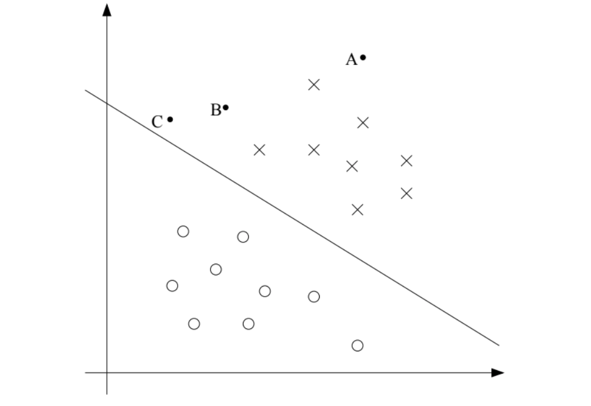

# Support Vector Machines

SVM 는 최고의 off-the-shelf 지도 학습 알고리즘 입니다.  
SVM 에 대해 말하기 위해, 우리는 우선 margin  과 큰 갭을 가진 분리된 데이터의 아이디어에 대해 이야기합니다.  
다음 우리는 최적 마진 클래시파이어 에 대해 이야기합니다.  이것은 Lagrange duality 에서 digression 으로 이끕니다.  
우리는 또한 커널을 봅니다. 그것은 매우 높은 차원의 공간에서 효율적으로 SVM 을 적용하는 방법을 알려줍니다.  
그리고 우리는 SVM 을 효과적으로 구현하는 SMO 알고리즘으로 이야기를 마무리합니다.  

## 1 Margins: Intuition

margin 에 대해 이야기 하면서 SVM 을 시작합니다.  
이 세션은 마진과 우리의 예측의 confidence 에 대한 직관을 줍니다. - 이러한 아이디어는 세션 3 에서 포멀하게 만듭니다. 

$h_{\theta}(x) = g(\theta ^T x)$ 로 모델된 확률 $p = (y =1 |x;\theta)$ 의 로지스틱 회귀에 대해 생각해 봅시다.  
그러면 입력 x 에 대해 1 을 예측하는 것은 $h_\theta (x) \geq 0.5$ 나 $\theta ^T x \geq 0$ 이  iff 로 동일합니다.    
postive 인 훈련 데이터를 고려해 봅시다.  
 $\theta ^T$  이 클수록, $h_\theta (x)=p(y=1|x;w,b)$ 도 커지고, 그래서 더 높은 'confidence' degree 를 얻습니다.  
그래서, 인포멀하기 우리는 우리의 예측을 매우 confident 하게 하는 되는 것이라고 생각할 수 있습니다. - y=1 if $\theta^Tx\gg0$.  
유사하게, 우리는 로지스틱 리그래션을 매우 confidence 한 predcition 을 만드는 것으로 생각할 수 있습니다. -  - y=0 if $\theta^Tx\ll 0$.   
훈련 셋이 주어졌을 때, 다시 인포멀하게 그것을 보면, 우리는 트레이닝 셋이 좋게 맞추는 것을 찾았습니다. - $\theta$ 를 찾을 때 $\theta^Tx(i)\gg 0$ , y^{(i)}=1 마다,   그리고 $y^{(i)}=1$ 마다 $\theta^Tx(i)\ll 0$ 입니다. 왜냐면 이것이 훈련셋에 대해  매우 confident 한 분류의 집합을 반영하기 때문입니다.   
이것은 좋은 목표로 보이고, 우리는 이러한 기능적인인 마진들의 개념을 사용하여 이 아이디어를 formalize 할 것입니다.  

다른 종류의 직관에 대해, 다음과 같은 그림을 봅시다.

Decision boundary 가 있습니다. 그리고 A,B,C 3개의 점이 있습니다.

점 A 는 결정 경계로 부터 많이 멀리 있습니다.   
만약 A 에 y 값에 대한 예측을 한다면, 이것은 꽤 confident 하게 y=1 일 것입니다.  
반대로 C 같은 경운 결정 경계가 매우 가까이 있습니다.  
이 것은 결정 경계가 조금 만 바뀌면 예측이 y=0 로 될 수 있습니다.  
그래서 우리는 우리의 예측에 대해 C에서보다 A 에 더 confident 합니다.    
점  B 는 두가지 경우 사이에 놓여져있습니다. 그우리는 볼 수 있습니다. 그 점이 분리 초평면으로 부터 더 멀리 떨어져 있다고, 그리고 우리는 아마굉장히 더 confident 할 수 있을 것입니다.   
다시, 인포멀하게 우리는 이것 이 좋다고 각할 수 있습니다. 만약 훈련셋이 주어지면, 우리는 결정 경계를 찾는 것을 매니지 하는 것이 그것은 우리에게 모드 정확하고, confident 한 예측이   
우리는 이후에 이러한 기하학적인 마진의 개념을 사용해 공식화 할 것입니다.  

## 2.Notation

SVM 에 대한 논의 더 쉽게만들기 위해 우리는 우선 분류에 대해 말하는 새로운 표기법을 도입해야합니다.  
우리는 고려할 것입니다 선형 분류자를 이진 분류 문제 에 대한, 라벨 y 와 피쳐들 x 를 가지나.  
이제, 우리는 y\in {-1,1} 을 사용해서 (0,1 대신) 클래스 라벨을 표기할 것입니다.  
또한 우리의 선형 분류자를 벡터  $\theta$ 로 파라미터화하는 대신, 우리는 파라미터 w, b 를 사용하여 다음과 같이 분류자를 표기할 것 입니다.  

$h_{w,b}(x) = g(w^Yx +b)$

여기서 z\geq 0 이면 g(z) = 1 이고,  아닌 경우 g(z) = -1 이 됩니다.   
w와 b 의 표기는 우리에게 명시적으로 다루는 것을 허용합니다. 텀 b 를 다른 파라미터와 분리해서  
(우린 또한 편하게 할 수 있습니다. - 우리가 이전에 x_0 =1 로 두어서 입력 피쳐 벡터에)  
그래서 이전에 $\theta_0$ 의 역할을 b 가 하고 $[\theta_1,\dots,\theta_n ]^T$ 를 w 가 합니다.  

또한, g 의 정의로 부터 우리의 분류자는 바로 1,-1 둘다 예측할 수 있습니다. (perceptron algorithm). 1이 되는 y 의 확률을 추정하는 중간 단계를 통하는 것 없이(- logistic regression 이 한 것)

## 3 Functional and geometric margins

함수적, 기하학적 margin 의 개념을 공식화해봅시다.  
훈렷 셋 (x^i,y^i) 가 주어졌을 때, 우리는 functional margin 을 다음과 같이 정의할 수 있습니다.  
$\hat \gamma = y^{(i)} (w^Tx + b) $  

만약 $y^i= 1$ 이라면, functional margin 은 커질 것 입니다.  - 예측이 confident 해지고 정확해진다.   
우리는 $ (w^Tx + b)$ 가 큰 양수 값이 되는 것이 필요합니다.  
반대로 $y^i = -1$ 이라면, 이는 커질 것 입니다.   
우리는 $(w^Tx + b)$ 가 큰 음수 값이 되는 것이 필요합니다.   
더욱이 $ y^{(i)} (w^Tx + b) > 0$ 이라면, example 에 대한 우리의 예측은 정확합니다.  
그리고 더 큰 functional margin은 confident 와  correct prediction 을 표현합니다. 

위에서 주어진 g 를 선택한 선형 분류자에 대해, functional margin 의 하나의 특성이 있습니다. 그것은 confidence 에 대한 좋은 측도가 아니라는 것 입니다.  
g 에 대한 우리의 선택이 주어졌을 때, 우리는 w 를 2w 와 같이 사용하더라도 h_wb(x) 는 변하지 않습니다.  
왜냐면 이는  (w^Tx + b) 부호에 대해서만 의존적이고, magnitude 와는 관련이 없기 때문입니다.    
그러나 w 에 2 를 곱하는 것은 functional margin 에 2 를 곱하는 결과와 동일합니다.  
그래서 